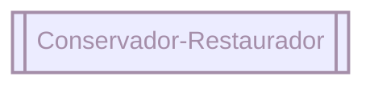
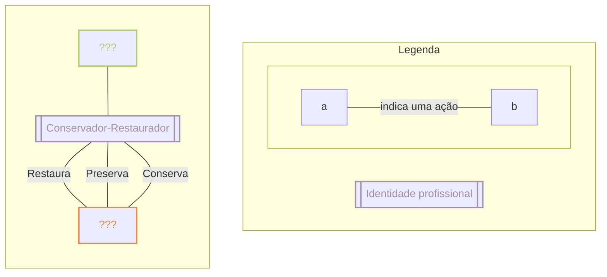
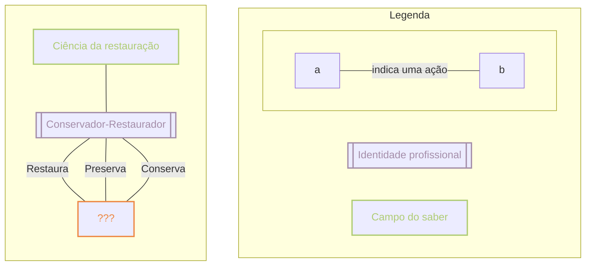
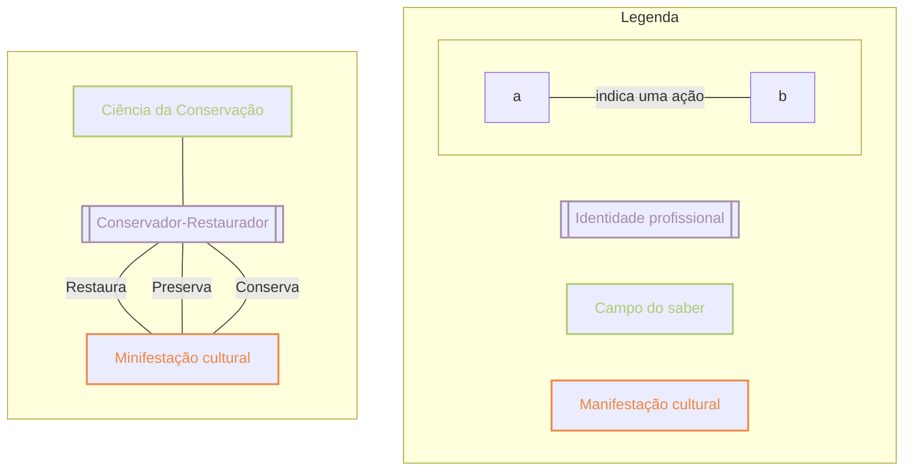

---
{"dg-publish":true,"permalink":"/tcc/","created":"2023-10-10T12:59:24.595-03:00","updated":"2023-10-10T13:30:13.087-03:00"}
---


<div class="transclusion internal-embed is-loaded"><div class="markdown-embed">


#  💡 Introdução 
<small>2023-05-17</small>


No contemporâneo a utilização do ambiente virtual para consumo de informações e entretenimento faz parte do cotidiano das pessoas, sobretudo nos centros urbanos. Observa-se uma sociedade cada vez mais inserida na cultura digital, o que torna a importância dos divulgadores científicos nas redes habitadas por essas pessoas de suma importância. <span style="background:#d3f8b6">Destacam-se como exemplos desse paradigma o reconhecimento de comunicadores científicos pelo Governo de Estado de São Paulo, através da Secretaria de Educação, que promoveu no ano de 2017 a premiação “Educação nas Redes: Novo Influenciadores Digitais” (SÃO PAULO, 2017) e a atuação de pesquisadores nas redes sociais, muitas vezes de forma independente, durante a crise de emergência sanitária do COVID-19, como apontam por exemplo Pellegrini (2021) e Moretti (2020).</span>


Os esforços e aplicação de estratégias das instituições de salvaguarda de bens culturais e dos restauradores para uma educação patrimonial e inclusão do público é inegável, inclusive no ciberespaço, mas a integração real com a cultura digital e mídias sociais, que por sua vez tem seus próprios meios de divulgar e consumir conteúdo, é cada vez mais necessária para o diálogo com toda uma parcela da população.

Investigar onde estão os divulgadores que conversam diretamente com a população sobre conservação e restauro com e sem a mediação direta de instituições - quais plataformas usam e qual seu público atual -, analisar suas formas de discurso e identificar as principais lacunas para um sistemático e efetivo diálogo com a população é o ponto de partida dessa pesquisa sobre a divulgação cientifica que se realiza nas mídias sociais no campo do restauro.

A análise desse discurso e sua comparação com as estratégias institucionais para engajamento e divulgação é um dos caminhos que também pode embasar uma comunicação mais efetiva desse espaço do saber. É importante considerar uma conjunção de fontes para a educação não-formal, pessoais (do próprio restaurador) e institucionais, para uma conscientização patrimonial sólida e a democratização do conhecimento do campo.

> “No entanto, talvez seja necessário começar com uma evidência: não se protege ou se conserva aquilo que não se considera útil de forma real ou simbólica.”  (GRAVIER, 2015, p.32)

Para uma proteção efetiva de bens culturais eles precisam assumir significados para a população, precisam ser apropriados, ressignificados, transformados em memória viva. Parecem então ser extremamente necessárias “atividades sistemáticas de divulgação” (REIS, 2018, p.74) para a sobrevivência não só da necessidade da conservação-restauração como profissão, mas para a salvaguarda dos bens culturais em si.

Um estudo dos métodos de divulgação para o campo da restauração se apresenta propicia para uma tentativa de luta contra “(...) a filosofia do para quê, especialmente em país onde o hábito é a desmemória, o continuado destruir para recomeçar o que já se iniciara (...)” (REIS, 2018, p.124) que habita não só na sociedade como no campo da cultura.  

Porém, como falar de restauração fora de suas tecnicalidades? Como engajar os usuários do ciberespaço a consumir este conteúdo de difícil digestão e possuidor de uma miríade de termos particulares? Partindo desses questionamentos surgiu o interesse em realizar uma pesquisa sobre os profissionais que tratam desse tema diretamente com a sociedade a partir das mídias sociais, considerando sua importância como ferramenta de divulgação, para entender as possíveis lacunas e dar o primeiro passo em uma longa busca sobre como falar e explicar sobre restauração nessas plataformas para promover uma democratização do conhecimento e do fazer do restaurador.

> Numa sociedade de classes como a nossa, é preciso sempre levar em consideração que os usos e apropriações dos bens se dão sempre de forma desigual; por isto, estabelecer o diálogo com os diferentes grupos torna-se uma estratégia mais do que necessária para a construção de caminhos e soluções para os possíveis problemas a serem enfrentados. (HORTA, 2015, p.78)

Sendo a divulgação também uma necessidade da área para o diálogo com diferentes grupos para diminuir a forma desigual com que estes se apropriam dos bens, as redes sociais se apresentam propícias.

Um dos primeiros objetivos quando este trabalho era ainda um pré-projeto 

- Mapear os divulgadores científicos de conservação e restauração no Brasil nas mídias sociais;
- Analisar o discurso que se realiza em conservação e restauração nessas mídias;

- Mapear a presença digital das instituições de salvaguarda em relação à conservação- restauração no ciberespaço e suas ações de divulgação cientifica da área.

## Referencial Teórico

A pesquisa proposta parte das ideias de Reis (MASSARANI; DIAS, 2018), na busca apaixonada sobre como divulgar o conhecimento científico, de como quebrar a torre de marfim do academicismo, na constante inovação dos métodos de fazer essa comunicação. Busca essa muito refletida também nos pensamentos e práticas de diversas instituições de guarda e de restauradores, sendo que a educação patrimonial se faz acima de tudo, em espaços de ensino não-formais:

> Embora a escola seja um espaço privilegiado para o desenvolvimento de ações de educação patrimonial, estas não se restringem à educação formal. Ao contrário, devem se estender aos mais diferentes grupos e espaços sociais, exatamente pela dimensão coletiva que o patrimônio cultural possui (...) (HORTA, 2015, p.73)

A busca de por onde já se “estendeu” a comunicação cientifica em conservação e restauro e quais outros “espaços sociais” no ciberespaço ela pode habitar de forma democrática e educativa, a despertar sensibilidades no cotidiano é um passo necessário.

> (...) o patrimônio não se protege per se: se não construímos uma consciência clara e altruísta de sua importância social, se não houver uma vontade de conservação da memória por parte daqueles que detêm sua propriedade, o limbo jurídico ao qual estão submetidos se evidencia. (GRAVIER, 2015, p.37)

Este trabalho também se encontra influenciado por dois eventos nacionais importantes, pois seu desenvolvimento se deu no espaço temporal em que eles se desenrolaram - o debate sobre proposta que regulamenta a profissão de Conservador-Restaurador de Bens Culturais pela Comissão de Trabalho da Câmara em agosto de 2022^[Regulamentação profissional de restauradores em debate - 11/08/22. Disponível em: <https://youtu.be/ghkUbPDh60I>. Acesso em: 10/03/2023], que movimentou a classe a se organizar nas redes sociais e a expor seu porquê na Câmara, e os atos terroristas de 08 de janeiro na Praça dos Três Poderes, em Brasilia^[Atos terroristas: os 11 pontos para entender tudo desde o 8 de janeiro. Exame. Disponível em: <https://exame.com/brasil/atos-terroristas-os-11-pontos-para-entender-tudo-desde-o-8-de-janeiro/>. Acesso em: 17/05/2023], que comoveram toda a nação devido ao seu caráter destrutivo, impingindo uma lista extensa de danos a diversos objetos patrimoniais e uma reação rápida do Estado e dos restauradores:

> **No dia seguinte** à depredação das sedes dos Três Poderes por terroristas, **o governo convocou restauradores de obras de arte de todo o país** para recuperar itens danificados. […] Nesse domingo(8) à noite, a ministra da Cultura, Margareth Menezes, determinou que o Iphan fizesse uma diligência para avaliar a **destruição no Palácio do Planalto, no Congresso Nacional, no Supremo Tribunal Federal e nos demais espaços tombados.** (Grifos nossos. Folha de Pernambuco^[Iphan e Ibram vão recuperar obras de arte danificadas por terroristas. Folha de Pernambuco. Disponível em: <https://www.folhape.com.br/noticias/iphan-e-ibram-vao-recuperar-obras-de-arte-danificadas-por-terroristas/253448/>. Acesso em: 17/05/2023]. 2023)

Este evento inspirou também uma resposta de apoio da Unesco^[# Unesco vai ajudar governo brasileiro a recuperar patrimônio depredado por terroristas em Brasília. G1. Disponível em: <https://g1.globo.com/politica/noticia/2023/01/12/unesco-vai-ajudar-governo-brasileiro-a-recuperar-patrimonio-depredado-por-terroristas-em-brasilia.ghtml>. Acesso em: 17/05/2023], afinal, Brasilia foi inscrita em 1987 na lista de patrimônios da humanidade da própria organização – esse titulo engloba o conjunto arquitetônico da Esplanada dos Ministérios e da Praça dos Três Poderes, que sofreu danos nos ataques de dia 08 de janeiro.


<span style="background:#d3f8b6">A criação de diálogo entre Reis (MASSARANI; DIAS, 2018), Foletto (2021), Lemos (2004), Tavares & Rezende (2014) e Bevilacqua & Barité (2019) e as próprias políticas de divulgação cientifica da Fundação Oswaldo Cruz têm a intenção de criar um ponto de partida para questionamentos construtivos sobre este tópico amplo com interfaces em várias áreas do conhecimento, e nos aproximarmos de algum entendimento sobre como dialogar nas mídias no tópico conservação e restauração para assim analisar os discursos utilizados pelos divulgadores apontados pelo levantamento com metodologia de análise do conteúdo de Bardin (1977).</span>

## Procedimentos metodológicos

Esta é uma pesquisa exploratória, cuja metodologia idealizada envolve as seguintes etapas:

1. Pesquisa bibliográfica;

2. Levantamento e segmentação das redes sociais e seus usuários, com vistas aos índices mais relevantes;

3. Pesquisa de criadores de conteúdo/divulgadores científicos no campo da conservação e restauro no Brasil e seu alcance a partir das redes levantadas;

4. Análise do discurso levantado a partir das redes pelos criadores/divulgadores e o público por eles engajado.

O primeiro passo será um levantamento bibliográfico com o objetivo de conformar um espaço teórico e prático para a realização da pesquisa. Posteriormente, identificam-se quais as redes sociais mais populadas, e realiza-se uma segmentação dos seus usuários a partir dos critérios relevantes para a pesquisa. Posteriormente, realiza-se a busca por conteúdo relacionado à atuação em conservação e restauração e seu alcance.

Pretende-se propor um tratamento estatístico aos dados levantados, conferindo caráter quantitativo à pesquisa, mas igualmente categorizar o conteúdo levantado a partir de referenciais da análise do conteúdo, de forma a realizar uma apreciação qualitativa.


Ao desenvolver este projeto<span style="background:rgba(5, 117, 197, 0.2)"> busco o panorama atual desses diálogos nas mídias sociais, tendo em consideração a necessidade da área pelo engajamento da sociedade e da democratização do saber da conservação-restauração e do conhecimento represado nas instituições de salvaguarda dos bens. Sabendo este panorama poderemos seguir um caminho embasado e ciente das lacunas para uma educação patrimonial e popularização cientifica do campo que habitem um espaço possivelmente ainda subaproveitado: o ciberespaço.</span>


</div></div>


<div class="transclusion internal-embed is-loaded"><div class="markdown-embed">


## Identidade, ferramentas, motivos

### **O que é um conservador-restaurador?**

<figcaption id="imagens">Ponto de partida</figcaption>


###### Fonte: Elaboração própria.

Gostaria de propor um exercício de visualização. Bojanoski, *et al.* (2017a, 2017b) nos apresentam a ideia de identidade do profissional conservador-restaurador, uma discussão através dos termos que a categoria profissional usa para se descrever, se reconhecer e difundir conhecimentos específicos entre seus pares.

Como fonte para essa análise, usam os anais dos congressos da Associação Brasileira de Conservadores-Restauradores (ABRACOR), publicados no período de 1985 a 2009 por considerarem este "o grupo mais significativo de textos com o potencial de […] estudo para a terminologia da área." (BOJANOSKI, MICHELON & BEVILACQUA, 2017b, p. 5.), as autoras acreditam que esses Anais "congregam profissionais de distintas regiões e com formações diversas"(BOJANOSKI, MICHELON & BEVILACQUA, 2017a, p. 11.). No caso específico deste estudo, o interesse provém do período e objeto - produções nacionais anteriores a 2010.

Das descobertas vejo necessário evocar os resultados da nuvem de palavras gerada através desse *corpus*:

<figcaption id="imagens">Nuvem de palavras ABRACOR
</figcaption>


###### Fonte: BOJANOSKI, MICHELON & BEVILACQUA, 2017a.


Se o "uso e o domínio da linguagem especializada espelha algumas características da área e […] contribuem para a construção da identidade profissional do grupo." (BOJANOSKI, MICHELON & BEVILACQUA, 2017a, p. 11.), vamos olhar mais atentamente para os termos associados ao fazer do conservador-restaurador^[Detalhes do processo de análise dos dados disponivel no Anexo I], fazendo uma divisão temática:

```chartsview
#-----------------#
#- chart type    -#
#-----------------#
type: Pie

#-----------------#
#- chart data    -#
#-----------------#
data:
  - type: "Arquitetura & Artes"
    value: 11
  - type: "Ciências Duras"
    value: 17
  - type: "Manifestação cultural"
    value: 23
  - type: "Ações ou método cientifico"
    value: 27
  - type: "Instituições e locais"
    value: 7
    

#-----------------#
#- chart options -#
#-----------------#
options:
  angleField: "value"
  colorField: "type"
  radius: 0.5
  label:
    type: "focus"
    content: "{percentage}\n{name}"
  legend:
    layout: "vertical"
    position: "left"
```

```chartsview
#-----------------#
#- chart type    -#
#-----------------#
type: Pie

#-----------------#
#- chart data    -#
#-----------------#
data:
  - type: "Arquitetura & Artes"
    value: 11
  - type: "Ciências Duras"
    value: 17
  - type: "Manifestação cultural"
    value: 23
  - type: "Ações ou método cientifico"
    value: 27
  - type: "Instituições e locais"
    value: 7
    

#-----------------#
#- chart options -#
#-----------------#
options:
  angleField: "value"
  colorField: "type"
  radius: 1
  label:
    type: "inner"
    content: "{percentage}\n{name}"
  legend:
    layout: "vertical"
    position: "left"
  interactions: 
    type: "element-active"
  state:
    active:
      style:
        lineWidth: 10
```

<figcaption id="imagens">Conservação, Preservação ou Restauração</figcaption>

```chartsview
#-----------------#
#- chart type    -#
#-----------------#
type: WordCloud

#-----------------#
#- chart data    -#
#-----------------#
data:
  - label: "estado de conservação"
    valores: 2
    category: "Conservação, Preservação ou Restauração"
  - label: "higienização"
    valores: 1
    category: "Conservação, Preservação ou Restauração"
  - label: "limpeza"
    valores: 1
    category: "Conservação, Preservação ou Restauração"
  - label: "acondicionamento"
    valores: 1
    category: "Conservação, Preservação ou Restauração"
  - label: "preservação"
    valores: 5
    category: "Conservação, Preservação ou Restauração"
  - label: "intervenção"
    valores: 2
    category: "Conservação, Preservação ou Restauração"
  - label: "tratamento"
    valores: 4
    category: "Conservação, Preservação ou Restauração"
  - label: "reintegração"
    valores: 1
    category: "Conservação, Preservação ou Restauração"
  - label: "remoção"
    valores: 3
    category: "Conservação, Preservação ou Restauração"
  - label: "restaurador"
    valores: 2
    category: "Conservação, Preservação ou Restauração"
  - label: "restauração"
    valores: 5
    category: "Conservação, Preservação ou Restauração"
  - label: "restauro"
    valores: 2
    category: "Conservação, Preservação ou Restauração"
  - label: "conservação"
    valores: 5
    category: "Conservação, Preservação ou Restauração"


#-----------------#
#- chart options -#
#-----------------#
options:
  wordField: label
  weightField: valores
  colorField: "valores"
  wordStyle:
    rotation: 0
    fontFamily: "Verdana"
    fontSize: [20, 50]
  interactions:
    type: "element-active"
  style:
    backgroundColor: "white"
  state:
    active:
      style:
        lineWidth: 3
```
###### Elaboração própria. Fonte: BOJANOSKI, MICHELON & BEVILACQUA, 2017a.

<figcaption id="imagens">Termos relacionados à investigação ou pesquisa</figcaption>

```chartsview
#-----------------#
#- chart type    -#
#-----------------#
type: WordCloud

#-----------------#
#- chart data    -#
#-----------------#
data:
  - label: "análise"
    valores: 2
    category: "Investigação"
  - label: " documentação"
    valores: 1
    category: "Investigação"
  - label: " estudo"
    valores: 1
    category: "Investigação"
  - label: " etapa"
    valores: 1
    category: "Investigação"
  - label: " fato"
    valores: 1
    category: "Investigação"
  - label: " fator"
    valores: 2
    category: "Investigação"
  - label: " identificação"
    valores: 2
    category: "Investigação"
  - label: " trabalho"
    valores: 1
    category: "Investigação"
  - label: " metodologia"
    valores: 3
    category: "Investigação"
  - label: " pesquisa"
    valores: 4
    category: "Investigação"
  - label: " método"
    valores: 2
    category: "Investigação"
  - label: " procedimento"
    valores: 2
    category: "Investigação"
  - label: " projeto"
    valores: 5
    category: "Investigação"
  - label: " proteção"
    valores: 3
    category: "Investigação"
  - label: " registro"
    valores: 2
    category: "Investigação"

#-----------------#
#- chart options -#
#-----------------#
options:
  wordField: label
  weightField: valores
  colorField: "valores"
  wordStyle:
    rotation: 0
    fontFamily: "Verdana"
    fontSize: [20, 50]
  interactions:
    type: "element-active"
  style:
    backgroundColor: "white"
  state:
    active:
      style:
        lineWidth: 6
```
###### Elaboração própria. Fonte: BOJANOSKI, MICHELON & BEVILACQUA, 2017a.


Aproveito também para acrescentar, como sugere Froner (2007), que as atividades de investigação e documentação são também uma atividade de preservação, pois preservam seu sentido, podemos ver os termos associados à investigação na Figura X. 
Com o apoio destes termos podemos então nos referir ao conservador-restaurador ao longo deste trabalho, como a identidade profissional do sujeito que, principalmente, conserva, restaura e preserva^["a prevalência dos termos conservação, restauração e preservação." (BOJANOSKI, MICHELON & BEVILACQUA, 2017a, p. 9.)"], resumindo os outros termos associados ao fazer da profissão. Agora sabemos quais termos os conservadores-restauradores usam para se descrever, mas ainda nos faltam peças no mapa (Figura Ações). Vamos explorar um pouco mais os termos usados nesses 24 anos de publicações para tentar chegar a algumas respostas.


<figcaption id="imagens">Ações</figcaption>



###### Elaboração própria. Fonte: BOJANOSKI, MICHELON & BEVILACQUA, 2017a.


### Acondicionamento,  arquitetura, arte, biblioteca, deterioração, documentação,  estudo, identificação, metodologia, patrimônio…. de quais saberes se mune o conservador-restaurador?

<figcaption id="imagens">Termos que se referem a campos do saber</figcaption>

```chartsview
#-----------------#
#- chart type    -#
#-----------------#
type: Pie

#-----------------#
#- chart data    -#
#-----------------#
data:
  - type: "Arquitetura"
    value: 4
  - type: "Artes"
    value: 7
  - type: "Biologia"
    value: 2
  - type: "Climatologia"
    value: 3
  - type: "Fisica de materiais"
    value: 6
  - type: "Quimica"
    value: 6


#-----------------#
#- chart options -#
#-----------------#
options:
  angleField: "value"
  colorField: "type"
  radius: 0.5
  label:
    type: "spider"
    content: "{percentage}\n{name}"
  legend:
    layout: "vertical"
    position: "left"
```
###### Elaboração própria. Fonte: BOJANOSKI, MICHELON & BEVILACQUA, 2017a.


A pluridisciplinaridade se apresenta de forma obvia, vamos olhar um pouco mais de longe - 60% dos termos usados que se referem a um campo do saber se referem a algum campo das ciências exatas, além dos termos relacionados às ciências humanas ou sociais aplicadas que vimos até agora. Estes dados são corroborados pela produção de Froner (2007, 2010) que elabora sobre os saberes necessários ao campo e a consolidação do que se tornaria seu nome:




> "A Ciência da Conservação torna-se articuladora entre a teoria cientifica das ciências exatas e humanas, e cada vez mais vem conduzindo pesquisas que envolvem profissionais acadêmicos e de instituições de museus, cujos resultados demonstram que a análise dos vários aspectos – culturais, econômicos, estilísticos, históricos, etc. – que um objeto artístico-cultural representa só é possível através da **interdisciplinaridade e do diálogo.**" (Grifos nossos, FRONER, 2007, p. 22.

### Objeto artístico-cultural, coleção, edificação, bem, obra, papel, patrimônio - Manifestações culturais


<figcaption id="imagens">Os alvos das ações</figcaption>

```chartsview
#-----------------#
#- chart type    -#
#-----------------#
type: WordCloud

#-----------------#
#- chart data    -#
#-----------------#
data:
  - label: "acervo"
    valores: 4
    category: "Manifestação Cultural"
  - label: "arquivo"
    valores: 1
    category: "Manifestação Cultural"
  - label: "arte"
    valores: 1
    category: "Manifestação Cultural"
  - label: "bem"
    valores: 2
    category: "Manifestação Cultural"
  - label: "bem cultural"
    valores: 1
    category: "Manifestação Cultural"
  - label: "biblioteca"
    valores: 2
    category: "Manifestação Cultural"
  - label: "coleção"
    valores: 4
    category: "Manifestação Cultural"
  - label: "cultural"
    valores: 1
    category: "Manifestação Cultural"
  - label: "edificação"
    valores: 3
    category: "Manifestação Cultural"
  - label: "encadernação"
    valores: 1
    category: "Manifestação Cultural"
  - label: "histórico"
    valores: 1
    category: "Manifestação Cultural"
  - label: "patrimônio"
    valores: 4
    category: "Manifestação Cultural"
  - label: "patrimônio cultural"
    valores: 1
    category: "Manifestação Cultural"
  - label: "tecido"
    valores: 2
    category: "Manifestação Cultural"
  - label: "patrimônio histórico"
    valores: 1
    category: "Manifestação Cultural"
  - label: "objeto"
    valores: 3
    category: "Manifestação Cultural"
  - label: "obra"
    valores: 3
    category: "Manifestação Cultural"
  - label: "papel"
    valores: 3
    category: "Manifestação Cultural"
  - label: "peça"
    valores: 1
    category: "Manifestação Cultural"
  - label: "pintura"
    valores: 4
    category: "Manifestação Cultural"
  - label: "suporte"
    valores: 3
    category: "Manifestação Cultural"
  - label: "tela"
    valores: 2
    category: "Manifestação Cultural"
  - label: "tela"
    valores: 2
    category: "madeira"


#-----------------#
#- chart options -#
#-----------------#
options:
  wordField: label
  weightField: valores
  colorField: "valores"
  wordStyle:
    rotation: 0
    fontFamily: "Verdana"
    fontSize: [20, 50]
  interactions:
    type: "element-active"
  style:
    backgroundColor: "white"
  state:
    active:
      style:
        lineWidth: 66
```
###### Elaboração própria. Fonte: BOJANOSKI, MICHELON & BEVILACQUA, 2017a.

Cerca de 27% do *corpus* ABRACOR se constitui de termos usados para se referir ao alvo das ações do conservador-restaurador. A multiplicidade desses alvos são também, em parte, os motivos de sua transdisciplinaridade - saberes especificos sobre física dos materiais . Afinal se Conserva, Preserva e Restaura "fontes documentais e culturais representativas da diversidade, da heterogenia, da alteridade e do multi-culturalismo." (FRONER, 2007, p. 23.). Essas fontes, ou manifestações culturais^["nem toda manifestação cultural é identificada pelo Estado como patrimônio cultural." (Moura, 2022, p.). Quero abordar questões politicas, mas não discutir o papel do Estado nesta dinâmica. Por isso a escolha de termos.], são alvo das ações dos conservadores-restauradores de forma desigual, impedido a execução de seu papel utópico de resistência às normas culturais dominantes: 

>"Os desafios relacionados à filosofia, ética e diretrizes nas ações concernentes à preservação perpassa pelos próprios desafios estruturais das sociedades capitalistas: o discurso oficial transmitido através da educação, da construção de museus, da seleção do que “merece” ser preservado, enfim, **a condução dos recursos financeiros, esforços humanos e discursos acadêmicos ou intelectuais mantêm as estruturas de dominação**  ao invés de permitir a multiplicidade ou a multiplicação de identidades. O discurso que nivela, mascara e silencia as diferenças." (Grifos nossos. FRONER, 2007, p. 23.)


Grande parte do chamado Temos então mais uma peça do nosso diagrama:

<figcaption id="imagens">Quem, o quê e como
</figcaption>



###### Elaboração própria. Fonte: BOJANOSKI, MICHELON & BEVILACQUA, 2017a.


### Porquê


> A Restauração não se faz em nome da Verdade, em nome da Ciência, em nome da Cultura ou em nome da Arte. A Restauração se faz para os **usuários dos objetos: aqueles para quem esses objetos cumprem uma função** essencialmente simbólica ou documental, mas talvez também de outros tipos. (MUÑOZ VIÑAS, 2021, p. 186)^[Publicação original de 2004, sendo traduzida para português em 2021]


Cada ator social, ou grupo de atores, *a priori*, se relaciona de diferente forma e intensidade com as diferentes tipologias, origens e contextos das manifestações culturais - isto é influenciado por diversos fatores a nível individual (nível de acessibilidade à manifestação, bagagem cultural e preferências do ator, citando alguns) e é também moldada pelo contexto histórico, político e econômico no qual ele está inserido. 

Uma comunidade pode apresentar um forte apego a uma determinada manifestação cultural, enquanto outra pode não demonstrar o mesmo nível de interesse. Alguns atores sociais podem ser mais receptivos a novas manifestações culturais, enquanto outros podem resistir a mudanças. As manifestações culturais podem ser utilizadas como instrumento de mobilização política ou como meio de expressar resistência às normas culturais dominantes. 

A relação entre os atores sociais e as manifestações culturais é complexa e multifacetada, dependendo de uma variedade de fatores específicos a cada contexto e por vezes conflitante - por isso:


Em uma sociedade democrática, os indivíduos têm o direito de participar ativamente em discussões políticas e processos de tomada de decisão. Essa participação é essencial para realizar a cidadania e garantir a efetividade dos direitos de participação popular. O que significa que a sobrevivência de uma manifestação cultural à ação do tempo deveria depender diretamente da vontade da sua permanência pelos atores sociais em conjunto com saber e o fazer do conservador-restaurador, afinal:


>A comunicação pode ajudar a própria ciência, sensibilizando a sociedade e os tomadores de decisão sobre a sua importância social e para o desenvolvimento do país. Estreitar o diálogo pode, inclusive, ajudar na reivindicação de mais recursos financeiros do setor. (CHAGAS & MASSARANI, 2020, p. 20)

> "O trabalho científico da preservação não pode ser conduzido em um vazio político. As decisões concernentes à dotação de recursos e à conservação das propriedades culturais implicam em considerações políticas. Um maior apoio político para a conservação e a preservação de bens culturais **dependerá de uma maior consciência pública de sua necessidade**." (Grifos do autor. FRONER, 2007, p. 22.)

Essa consciência pública, por sua vez, também não pode ser gerada num vazio, nem deve ser abordada por um viés de déficit - como pode ser visto em discussões sobre a compreensão pública da ciência, tendo como exemplo Brossard & Lewenstein(2009). Esta consciência só pode ser criada mediante diálogo e escuta ativa dos interesses de outra peça chave da nossa narrativa - o Ator Social, a composição unitária de uma sociedade democrática. 

Porém, vimos que essa relação, apesar de lógica, não se dá de forma tão fluida e transparente assim - os próprios termos que definem o profissional, na verdade, criam barreiras de acesso à informação para os Atores Sociais: Woolston (2020) indica que pessoas não-cientistas se sentem excluídas e confusas por artigos que utilizam linguagem técnica, mesmo que esta seja explicada. Resultados similares foram encontrados por Bullock *et al* (2019) na sua busca por entender como o jargão afeta as audiências tendo em vista a crescente lacuna de comunicação entre as comunidades científicas e o público:

>a presença de jargão prejudica a capacidade das pessoas de processar informações científicas e que esse prejuízo leva a uma maior resistência motivada à persuasão, aumento das percepções de risco e menor apoio à adoção de tecnologia. Esses resultados sugerem que o uso de jargão compromete os esforços para informar e persuadir o público por meio do mecanismo cognitivo da metacognição."(BULLOCK *et al*, 2019, p. 1.)

Porém, nos vemos presos num círculo de raciocínio, talvez um indicativo de porquê o conservador-restaurador não se encanta pela divulgação-cientifica:

>[...] embora os conservadores-restauradores já possuam um trajeto histórico e social que lhes permite delimitar uma identidade profissional, ainda existem variações denominativas e conceituais nos termos fundamentais que definem o campo. Tais variações podem constituir um problema, na medida em que geram dúvidas e incertezas sobre as funções destes profissionais no campo do patrimônio cultural.(BOJANOSKI, MICHELON & BEVILACQUA, 2017, p. 11.)


***
Além dessa dimensão politica-conceitual, conservador-restaurador é também um sujeito que restaura, conserva e preserva manifestações culturais através do uso da Ciências "Duras":


Ao longo deste capitulo tentei articular como o conservador-restaurador pode se beneficiar


Por sua vez, museólogos, educadores e outros cientistas se apropriam das manifestações culturais como objeto (ou alvo) de ações de educação patrimonial, divulgação cientifica e popularização da ciência, ou de difusão cultural para engajar nossa ultima peça do quebra cabeça: os diversos atores sociais através das mais diversas estratégias formais e não-formais de educação.


**Restaura**


**Conserva** & **Preserva**


**O papel social**


> 
Na Teoria Contemporânea da Restauração (MUÑOZ VIÑAS, 2021), livro publicado no seu idioma original em 2004, tenta definir

Esta perspectiva previlegiada do conservador-restaurador o torna também um excelente locutor de suas multidisciplinariedades à sociedade


<br><br><br>

### Bibliografia
- BOJANOSKI, S.; MICHELON, F. F.; BEVILACQUA, C. R. [[01. Inbox/Os termos preservação, restauração, conservação e conservação preventiva de bens culturais - uma abordagem terminológica\|Os termos preservação, restauração, conservação e conservação preventiva de bens culturais  - uma abordagem terminológica]]. **Calidoscopio**, 2017a.
- BOJANOSKI, S. DE F.; MICHELON, F. F.; BEVILACQUA, C. R. Análise do corpus para um estudo terminológico da área da conservação e restauração de bens culturais. **Debate Terminológico [Porto Alegre, RS]**, v. 17, p. 33–45, 2017b.
- BULLOCK, O. M. et al. Jargon as a barrier to effective science communication - Evidence from metacognition. **Public Understanding of Science**, v. 28, n. 7, p. 845–853, out. 2019.
- BROSSARD, Dominique; LEWENSTEIN, Bruce V. [[01. Inbox/A Critical Appraisal of Models of Public Understanding of Science - Using Practice to Inform Theory\|A Critical Appraisal of Models of Public Understanding of Science]]: Using Practice to Inform Theory. Em: **Communicating Science**. Nova York, Routledge, 2009. p. 25–53.
- FRONER, Y.-A. [[03. Acervos/📜️/& 2023-06-10 - Memória e Preservação - a construção epistemológica da Ciência da Conservação\|**Memória e Preservação: a construção epistemológica da Ciência da Conservação**]]. 2007. Disponível em: <[http://antigo.casaruibarbosa.gov.br/dados/DOC/palestras/memo_info/mi_2007/FCRB_MI_Memoria_e_Preservacao_A_construcao_epistemologica_da_Ciencia_da_Conservacao.pdf](http://antigo.casaruibarbosa.gov.br/dados/DOC/palestras/memo_info/mi_2007/FCRB_MI_Memoria_e_Preservacao_A_construcao_epistemologica_da_Ciencia_da_Conservacao.pdf)>. Acesso em: 9 jun. 2023.
- FRONER, Y. Conservação e Restauração legitimação de ciencia. **Acervo**, v. 23, p. 47–56, dez. 2010.
- FRONER, Y.-A. [[& 2023-06-09 - Historical issues - the basis of Conservation Science and Conservator-Restorer training \| Historical issues]]: the basis of Conservation Science and Conservator-Restorer training. **Conservar Património**, v. 23, p. 15–23, 2016a.
- FRONER, Y.-A. [[01. Inbox/& 2023-06-09 - A CONSTITUIÇÃO DA CIÊNCIA DA CONSERVAÇÃO E A PROJEÇÃO DA CIÊNCIA DO PATRIMÔNIO\|A CONSTITUIÇÃO DA CIÊNCIA DA CONSERVAÇÃO E A PROJEÇÃO DA CIÊNCIA DO PATRIMÔNIO]] . **Geonomos**, 31 dez. 2016b.
- MUÑOZ VIÑAS, Salvador. Teoria contemporânea da restauração. Belo Horizonte, Editora UFMG, 2021.
- WOOLSTON, C. Words matter - jargon alienates readers. **Nature**, v. 579, n. 7798, p. 309–309, 12 mar. 2020.


</div></div>


<div class="transclusion internal-embed is-loaded"><div class="markdown-embed">


#  💡 2.1 Perspectivas iniciais 
<small>2023-05-17</small>

## Rascunho

Imagem 1 - Mapa


 
O ICCROM (Centro Internacional para o Estudo da Preservação e Restauração de Bens Culturais) é uma organização intergovernamental criada em 1956 pela UNESCO. Seu mandato é promover a conservação do patrimônio cultural, móvel e imóvel em todo o mundo^[Conservation science: Reflections and future perspectives. https://www.tandfonline.com/doi/full/10.1080/00393630.2015.1117858 Acessado 10/06/2023.]. A ICCROM é uma parceira ativa na *World Heritage Information Network* (Rede Mundial de Informações sobre Patrimônio Mundial) e oferece orientação especializada sobre como conservar e gerenciar propriedades listadas. Além disso, ela oferece uma variedade de oportunidades de treinamento para profissionais responsáveis por seu cuidado^[ICCROM - Questions and Answers - UNESCO World Heritage Centre. https://whc.unesco.org/en/faq/37 Acessado 10/06/2023.]. A contribuição da ICCROM é desenvolver recursos humanos e técnicas sustentáveis para a conservação do patrimônio por meio de programas de treinamento^[Science, technology and ICCROM - UNESCO. https://unesdoc.unesco.org/ark:/48223/pf0000186967 Acessado 10/06/2023.]. Isso faz da ICCROM um recurso importante para profissionais de ciência de conservação e outras ciêcias do patrimônio[4].


**Escolhendo um ponto de partida: *ICCROM FORUM on Conservation Science Rome, 16-18 October 2013***


O Fórum ICCROM de outubro de 2013, reuniu 80 profissionais do setor do patrimônio cultural, provindos de 15 instituições e 14 países membros, seu objetivo foi  "[…] organizar um grupo de reflexão internacional para analisar criticamente o papel atual e as direções futuras da ciência no campo da conservação do patrimônio cultural […] e estabelecer prioridades-chave para um futuro de mais impacto." (Tradução própria^["*organised an international think tank to critically reflect on the current role and future directions of science in the field of cultural heritage conservation […] and to set key priorities for a more impactful future.*"], ICCROM, 2017)

Este conjunto de profissionais discutiu tópicos focados em aspectos de três temas: o "papel da ciência no setor do patrimônio cultural, sua contribuição para a sociedade em geral e as direções estratégicas futuras para a ciência da conservação."(Tradução própria^["*the role of science within the cultural heritage sector, its contribution to wider society, and future strategic directions for conservation science.*"] , ICCROM, 2017), divididos em diversas mesas de discussão. 


Alguns dos debates que influenciaram as visões sobre a preservação do patrimônio cultural e a prática do conservador-restaurador nos últimos dez anos originaram-se a partir deste evento, os desafios-chave para o campo e recomendações nela discutidos são norteadores da profissão 

então uma exploração se vê necessária. Quais são as perspectivas sobre divulgação cientifica neste momento de utopia? 


Nesta etapa, partiremos dos Relatórios dos Grupos de Discussão do Forum, passando pela lista de Prioridades-chave para o patrimônio cultural lá definidas e pelo resumo do evento, três produções do próprio ICCROM (2013, 2016, 2017) sobre o Fórum de 2013, vamos caminhar pelas discussões dos profissionais sobre comunicação com o publico e divulgação cientifica.


>A comunicação pode ajudar a própria ciência, sensibilizando a sociedade e os tomadores de decisão sobre a sua importância social e para o desenvolvimento do país. Estreitar o diálogo pode, inclusive, ajudar na reivindicação de mais recursos financeiros do setor. (CHAGAS & MASSARANI, 2020, p. 20)


<br><br><br>
### Bibliografia

**Key Challenges | ICCROM**. 2016. Disponível em: <[https://www.iccrom.org/section/heritage-science/key-challenges](https://www.iccrom.org/section/heritage-science/key-challenges)>. Acesso em: 25 maio. 2023.

"**Heritage conservation science 2013 | ICCROM**. 2017. Disponível em: <[https://www.iccrom.org/section/heritage-conservation-science-2013](https://www.iccrom.org/section/heritage-conservation-science-2013)>. Acesso em: 25 maio. 2023."


[Mais sobre em: Conservation Science | ICCROM. https://www.iccrom.org/publication/conservation-science Acessado 10/06/2023. e Educating future professionals in conservation science .... https://www.tandfonline.com/doi/full/10.1080/00393630.2015.1117864 Acessado 10/06/2023.].


***


***
| Relacionados                                                                                                                                                                                                                                                      |
| ----------------------------------------------------------------------------------------------------------------------------------------------------------------------------------------------------------------------------------------------------------------- |
| [[08. Memex/{{{Date}}} - Anuário brasileiro de propaganda - Google Books\|{{{Date}}} - Anuário brasileiro de propaganda - Google Books]]<br><small>*Modificado em: 6:31 PM - October 07, 2023*</small> \| <small>Criado em: 5:08 PM - October 07, 2023</small> |

{ .block-language-dataview}
***

- 📝️ Minhas anotações
	- 🌱️ Mudinha - Ideia que tive ou coisa para pesquisar: Básicamente so um geral do que é aquilo sem muita pesquisa.
	- 🌿️ Arbusto - Nota que já teve alguma pesquisa, já deve ter algumas conexões e citações.
	- 🌞️ Incubando. Não estou mexendo nessas partes do jardim Items para o futuro.
	- 🌲️ Arvore - Quando a nota não vai mais ser editada, virou uma arvore adulta no jardim. Geralmente são textos que já viraram alguma outra coisa (trabalho acadêmico, artigo, papo na mesa de buteco, etc)
		- 🟥️ Não processada
		- 🟧️️ Processando
		- 🟨️ Sintetizando
		- 🟩️️ Completa!
	- 

### Outras notas com o mesmo tema


``` dataview
table  status AS "Status", keywords AS "Palavras-Chave", created AS "Criado em:"
from "04. Cadernos" and -"04. Cadernos/ Arquivos_congelados"
where contains(tema, "TCC") or contains(keywords, "TCC") 
sort updated DESC
LIMIT 10
```

***


</div></div>


<div class="transclusion internal-embed is-loaded"><div class="markdown-embed">


#  💡 2.3 Como engajamos 
<small>2023-05-17</small>

- Breve discussão sobre educação não formal e algumas estratégias de divulgação cientifica e cultural no contexto do restaurador empregadas no Brasil
- A diferença do engajamento com o patrimonio digital
	-  [[03. Acervos/📜️/& 2023-02-22 - 📜️ cookDigitalHeritageCollaborative2019\|& 2023-02-22 - 📜️ cookDigitalHeritageCollaborative2019]] 


<br><br><br>
***


***
| Relacionados                                                                                                                                                                                                                                                      |
| ----------------------------------------------------------------------------------------------------------------------------------------------------------------------------------------------------------------------------------------------------------------- |
| [[08. Memex/{{{Date}}} - Anuário brasileiro de propaganda - Google Books\|{{{Date}}} - Anuário brasileiro de propaganda - Google Books]]<br><small>*Modificado em: 6:31 PM - October 07, 2023*</small> \| <small>Criado em: 5:08 PM - October 07, 2023</small> |

{ .block-language-dataview}
***

- 📝️ Minhas anotações
	- 🌱️ Mudinha - Ideia que tive ou coisa para pesquisar: Básicamente so um geral do que é aquilo sem muita pesquisa.
	- 🌿️ Arbusto - Nota que já teve alguma pesquisa, já deve ter algumas conexões e citações.
	- 🌞️ Incubando. Não estou mexendo nessas partes do jardim Items para o futuro.
	- 🌲️ Arvore - Quando a nota não vai mais ser editada, virou uma arvore adulta no jardim. Geralmente são textos que já viraram alguma outra coisa (trabalho acadêmico, artigo, papo na mesa de buteco, etc)
		- 🟥️ Não processada
		- 🟧️️ Processando
		- 🟨️ Sintetizando
		- 🟩️️ Completa!
	- 

### Outras notas com o mesmo tema


``` dataview
table  status AS "Status", keywords AS "Palavras-Chave", created AS "Criado em:"
from "04. Cadernos" and -"04. Cadernos/ Arquivos_congelados"
where contains(tema, "TCC") or contains(keywords, "TCC") 
sort updated DESC
```

***
| Relacionados                                                                                                                                                                                                                                                      |
| ----------------------------------------------------------------------------------------------------------------------------------------------------------------------------------------------------------------------------------------------------------------- |
| [[08. Memex/{{{Date}}} - Anuário brasileiro de propaganda - Google Books\|{{{Date}}} - Anuário brasileiro de propaganda - Google Books]]<br><small>*Modificado em: 6:31 PM - October 07, 2023*</small> \| <small>Criado em: 5:08 PM - October 07, 2023</small> |

{ .block-language-dataview}
***


- 📝️ Minhas anotações
	- 🌱️ Mudinha - Ideia que tive ou coisa para pesquisar: Básicamente so um geral do que é aquilo sem muita pesquisa.
	- 🌿️ Arbusto - Nota que já teve alguma pesquisa, já deve ter algumas conexões e citações.
	- 🌞️ Incubando. Não estou mexendo nessas partes do jardim Items para o futuro.
	- 🌲️ Arvore - Quando a nota não vai mais ser editada, virou uma arvore adulta no jardim. Geralmente são textos que já viraram alguma outra coisa (trabalho acadêmico, artigo, papo na mesa de buteco, etc)
		- 🟥️ Não processada
		- 🟧️️ Processando
		- 🟨️ Sintetizando
		- 🟩️️ Completa!
	- 


| Arquivo                                                                                                                                                                                                                                                                                                                                                                                                                                                                   | Porque me interessa?                                             | Canal                | Conteudo do video                            | Tipo de Abordagem | Público alvo             | Visualizações | Nº 👍 | Nº Comentários | Suporte        |
| ------------------------------------------------------------------------------------------------------------------------------------------------------------------------------------------------------------------------------------------------------------------------------------------------------------------------------------------------------------------------------------------------------------------------------------------------------------------------- | ---------------------------------------------------------------- | -------------------- | -------------------------------------------- | ----------------- | ------------------------ | ------------- | ----- | -------------- | -------------- |
| [[03. Acervos/🎓/CRBCM_UFMG/Conservação Preventiva\|Conservação Preventiva]]                                                                                                                                                                                                                                                                                                                                                                                           | \-                                                               | \-                   | \-                                           | \-                | \-                       | \-            | \-    | \-             | \-             |
| [[03. Acervos/🎓/CRBCM_UFMG/Causas de Deterioração em Bens Culturais\|Causas de Deterioração em Bens Culturais]]                                                                                                                                                                                                                                                                                                                                                       | \-                                                               | \-                   | \-                                           | \-                | \-                       | \-            | \-    | \-             | \-             |
| [[03. Acervos/🎓/EDPC_Fiocruz/Acessibilidade cultural - desafios e construção de estratégias para a divulgação científica e a educação museal\|Acessibilidade cultural - desafios e construção de estratégias para a divulgação científica e a educação museal]]                                                                                                                                                                                                       | \-                                                               | \-                   | \-                                           | \-                | \-                       | \-            | \-    | \-             | \-             |
| [[03. Acervos/🎓/EDPC_Fiocruz/Museus e Educação Não Formal\|Museus e Educação Não Formal]]                                                                                                                                                                                                                                                                                                                                                                             | \-                                                               | \-                   | \-                                           | \-                | \-                       | \-            | \-    | \-             | \-             |
| [[03. Acervos/📰️/( 2023-03-11  - 📰️ Create your own Word Cloud - Towards Data Science\|( 2023-03-11  - 📰️ Create your own Word Cloud - Towards Data Science]]                                                                                                                                                                                                                                                                                                       | \-                                                               | \-                   | \-                                           | \-                | \-                       | \-            | \-    | \-             | \-             |
| [[03. Acervos/📰️/( 2023-04-02  - 📰️ rObsidianMD - My setup as a researcher. How to write, run statistics, and work seamlessly with R, Obsidian, Linux, and Zotero, and collaborate with senior professors who only accept MS Word files!\|( 2023-04-02  - 📰️ rObsidianMD - My setup as a researcher. How to write, run statistics, and work seamlessly with R, Obsidian, Linux, and Zotero, and collaborate with senior professors who only accept MS Word files!]] | \-                                                               | \-                   | \-                                           | \-                | \-                       | \-            | \-    | \-             | \-             |
| [[03. Acervos/📜️/& 2023-02-22 - 📜️ heritageConservationScienceReflections2015\|& 2023-02-22 - 📜️ heritageConservationScienceReflections2015]]                                                                                                                                                                                                                                                                                                                       | \-                                                               | \-                   | \-                                           | \-                | \-                       | \-            | \-    | \-             | \-             |
| [[03. Acervos/📜️/& 2023-03-01 - 📜️ Ja estamos la (2022)\|& 2023-03-01 - 📜️ Ja estamos la (2022)]]                                                                                                                                                                                                                                                                                                                                                                   | \-                                                               | \-                   | \-                                           | \-                | \-                       | \-            | \-    | \-             | \-             |
| [[03. Acervos/📜️/& 2023-02-24 - 📜️ Discussion Group Reports\|& 2023-02-24 - 📜️ Discussion Group Reports]]                                                                                                                                                                                                                                                                                                                                                           | \-                                                               | \-                   | \-                                           | \-                | \-                       | \-            | \-    | \-             | \-             |
| [[03. Acervos/📜️/& 2023-02-24 - 📜️ Communicating conservation science\|& 2023-02-24 - 📜️ Communicating conservation science]]                                                                                                                                                                                                                                                                                                                                       | \-                                                               | \-                   | \-                                           | \-                | \-                       | \-            | \-    | \-             | \-             |
| [[03. Acervos/📜️/& 2023-06-04 - Looking again at non-formal and informal education\|& 2023-06-04 - Looking again at non-formal and informal education]]                                                                                                                                                                                                                                                                                                               | \-                                                               | \-                   | \-                                           | \-                | \-                       | \-            | \-    | \-             | \-             |
| [[03. Acervos/📜️/& 2023-05-23 - O desafio da comunicação nos museus universitários\|& 2023-05-23 - O desafio da comunicação nos museus universitários]]                                                                                                                                                                                                                                                                                                               | \-                                                               | \-                   | \-                                           | \-                | \-                       | \-            | \-    | \-             | \-             |
| [[03. Acervos/📜️/& 2023-06-04 - Caderno da Política Nacional de Educação Museal\|& 2023-06-04 - Caderno da Política Nacional de Educação Museal]]                                                                                                                                                                                                                                                                                                                     | \-                                                               | \-                   | \-                                           | \-                | \-                       | \-            | \-    | \-             | \-             |
| [[03. Acervos/📜️/& 2023-06-04 - INCURSÕES SOBRE OS TERMOS E CONCEITOS DA EDUCAÇÃO MUSEAL\|& 2023-06-04 - INCURSÕES SOBRE OS TERMOS E CONCEITOS DA EDUCAÇÃO MUSEAL]]                                                                                                                                                                                                                                                                                                   | \-                                                               | \-                   | \-                                           | \-                | \-                       | \-            | \-    | \-             | \-             |
| [[03. Acervos/📜️/& 2023-06-10 - Memória e Preservação - a construção epistemológica da Ciência da Conservação\|& 2023-06-10 - Memória e Preservação - a construção epistemológica da Ciência da Conservação]]                                                                                                                                                                                                                                                         | \-                                                               | \-                   | \-                                           | \-                | \-                       | \-            | \-    | \-             | \-             |
| [[03. Acervos/📜️/& 2023-06-09 - Historical issues - the basis of Conservation Science and Conservator-Restorer training\|& 2023-06-09 - Historical issues - the basis of Conservation Science and Conservator-Restorer training]]                                                                                                                                                                                                                                     | \-                                                               | \-                   | \-                                           | \-                | \-                       | \-            | \-    | \-             | \-             |
| [[03. Acervos/📜️/Há sentido na Educação Não Formal na perspectiva da Formação Integral\|Há sentido na Educação Não Formal na perspectiva da Formação Integral]]                                                                                                                                                                                                                                                                                                       | \-                                                               | \-                   | \-                                           | \-                | \-                       | \-            | \-    | \-             | \-             |
| [[03. Acervos/🖼️ Acervo Conservação-Restauração/+ 2023-03-09   -  🎥️ Restaurado Muro Escultórico de Athos Bulcão - 310123\|+ 2023-03-09   -  🎥️ Restaurado Muro Escultórico de Athos Bulcão - 310123]]                                                                                                                                                                                                                                                              | <ul><li>Recente</li><li>Aproveita a onda adas hardnews</li></ul> | Câmara dos Deputados | <ul><li>Entrevista com restaurador</li></ul> | Técnica           | <ul><li>leigos</li></ul> | 729           | 11    | 1              | madeira e laca |
| [[03. Acervos/🖼️ Acervo Conservação-Restauração/; 2023-03-08 - 🗨️ Arte é Investimento\|; 2023-03-08 - 🗨️ Arte é Investimento]]                                                                                                                                                                                                                                                                                                                                      | \-                                                               | \-                   | \-                                           | \-                | \-                       | \-            | \-    | \-             | \-             |

{ .block-language-dataview}

### Outras notas com o mesmo tema


``` dataview
table  status AS "Status", keywords AS "Palavras-Chave", created AS "Criado em:"
from "04. Cadernos" and -"04. Cadernos/ Arquivos_congelados"
where contains(tema, "TCC") or contains(keywords, "TCC") 
sort updated DESC
```

***


</div></div>


<div class="transclusion internal-embed is-loaded"><div class="markdown-embed">


#  💡 3.2 Estudos de caso 
<small>2023-05-17</small>

Escopo: acabou se manifestando em uma multiplicidade de pontos de vista, diversa em viéses mas homogenea em narrativas dialogos.


### 3.2.1 Arte de Fato


<div class="transclusion internal-embed is-loaded"><a class="markdown-embed-link" href="/04-cadernos/2022-03-canal-arte-de-fato-programa-atelie-de-restauro/" aria-label="Open link"><svg xmlns="http://www.w3.org/2000/svg" width="24" height="24" viewBox="0 0 24 24" fill="none" stroke="currentColor" stroke-width="2" stroke-linecap="round" stroke-linejoin="round" class="svg-icon lucide-link"><path d="M10 13a5 5 0 0 0 7.54.54l3-3a5 5 0 0 0-7.07-7.07l-1.72 1.71"></path><path d="M14 11a5 5 0 0 0-7.54-.54l-3 3a5 5 0 0 0 7.07 7.07l1.71-1.71"></path></svg></a><div class="markdown-embed">


## O que é?

• O **Ateliê de Restauro** é um dos programas dentro do canal [[03. Acervos/🖼️ Acervo Conservação-Restauração/; 2023-03-10 - 🗨️ Arte de fato\|Arte de fato]] do Youtube;

• Até a presente data, a playlist do Ateliê de Restauro possui **24 vídeos**, publicados entre maio de  2019 e outubro de 2021. Não existe indicio que o projeto tenha-se encerrado, mas aparenta estar pausado desde a ultima publicação;

• O canal Arte de Fato possui mais 2 programas: o Artes & Negócios e o Retrato Entrevista;

• Os vídeos publicados tratam de **restauro de livros, encadernação, reserva técnica, museus,** **bibliotecas e do fazer do conservador restaurador;**

• Os vídeos têm entre **3 e 15 minutos** de duração, mas foram feitas 3 transmissões ao vivo pelo canal, com duração maior;

• Um vídeo de entrevista foi feito para abordar a profissão e o COVID e os principais problemas das reservas técnicas fechadas.


## Por quê?

• Não existe documentação oficial sobre o objetivo do projeto, porém em alguns vídeos a apresentadora dá dicas:

• No vídeo Como conservar livros - Conheça 10 Inimigos aos 1:57 minutos:

>“Popularizar, divulgar para um publico amplo, conhecimentos e valores normalmente acessíveis em abordagens acadêmicas ou técnicas.” (SANCHES, Cristina)


• No vídeo *Como agir corretamente na pandemia LIVRE-SE DOS ERROS MAIS COMUNS* aos 1:00 minuto:

>“Fazemos assim porque acreditamos na popularização de valores como a importância da preservação do patrimônio e da cultura [...]” (SANCHES, Cristina)


• No vídeo [[03. Acervos/🖼️ Acervo Conservação-Restauração/+ 2023-03-10   -  🎥️ Como limpar fungos em livros [ATUALIZADO 2022]  ATELIÊ de RESTAURO\|+ 2023-03-10   -  🎥️ Como limpar fungos em livros [ATUALIZADO 2022]  ATELIÊ de RESTAURO]] aos 1:26 minutos:

>[...] nós queremos com esse vídeo poder ajudar a divulgar boas informações e *pesquisas cientificas que ajudem a preservar os nossos acervos e bibliotecas* [...]” (SANCHES, Cristina)

## Por quem?

• O Ateliê de Restauro é um projeto da conservadora e restauradora Cristina Sanches, segundo seu currículo *Lattes*:

>Mestranda no programa de pós graduação em História da Ciência pela PUC-SP, fez especialização em Metodologia do Ensino na Educação Superior EAD pela Uninter (2019), é  bacharel em Artes Plásticas pela Fundação Armando Álvares Penteado (2001). Se formou  especialista em preservação, conservação e restauro de obras de arte em documentos gráficos SENAI ABER (2001) e Licenciatura Plena em Educação Artística - Faculdades Integradas Teresa D'Avila (1998). Disponível em: <http://lattes.cnpq.br/8647139936482275>. Acesso em 22/04/2022.

>Atualmente é a **responsável técnica do laboratório de conservação e restauro do Senai**. É professora de conservação e restauro desde 2003 na Escola SENAI Theobaldo D' Nigris, atua também em pesquisa, conservação e restauro, educação e ensino. Disponível em: <http://lattes.cnpq.br/8647139936482275)*>. Acesso em 22/04/2022.*

## Para quem?

• População em geral:

• Usa hashtags atrativas #cuidardelivros #amolivro #cuidadoscomlivros

#cuidadoscombibioteca #livros #biblioteca #livrosmofados #bolor

#papelreciclado #papelartesanal #papelfeitoamao **para atrair públicos de nicho.**

• Leigos em busca de formação na área;

• Pessoas já formadas na área.


## Quem paga?

• O canal aparenta ter sido criado pela própria Cristina Sanches e seu marido, responsável pelos outros dois programas do canal;

• Não foram encontrados dados sobre financiamento;

• Escola SENAI Theobaldo D' Nigris é mencionada e aparece em filmagens por ser o local de trabalho da restauradora;

• Biblioteca da St. Casa de Misericórdia seus objetos e processos de restauração ao qual foram submetidos é alvo de duas *lives*.

## O que funciona/funcionou?

• O projeto demonstra de forma leve alguns dos modos de fazer do conservador-restaurador em conjunto com dicas utilizáveis no dia a dia para quem quer apenas manter sua coleção sadia;

• Os vídeos de objetos específicos passando por tratamento, que demonstra o que um restaurador faz, e como faz;

• Um dos vídeos mais interessantes é a entrevista com o tema COVID, que fala por um viés da profissão e outros problemas que podemos ter em reservas devido ao tempo fechado e sem supervisão;

## O que funciona/funcionou?

• Introduz de forma interessante conceitos complexos da área como agentes de degradação e processos de analises químicas;

• Dá dicas de como lidar com problemas na sua biblioteca, os mais vistos foram:

• [[03. Acervos/🖼️ Acervo Conservação-Restauração/+ 2023-03-11   -  🎥️ BOLOR nos livros! O que fazer  ATELIÊ de RESTAURO\|+ 2023-03-11   -  🎥️ BOLOR nos livros! O que fazer  ATELIÊ de RESTAURO]]

• [[03. Acervos/🖼️ Acervo Conservação-Restauração/+ 2023-03-10   -  🎥️ Como Limpar Livro Antigo [Método Definitivo]  ATELIÊ de RESTAURO\|+ 2023-03-10   -  🎥️ Como Limpar Livro Antigo [Método Definitivo]  ATELIÊ de RESTAURO]]

• [[03. Acervos/🖼️ Acervo Conservação-Restauração/+ 2023-03-11   -  🎥️ Como fazer Papel Reciclado [ Fórmula Fácil ]  ATELIÊ de RESTAURO\|+ 2023-03-11   -  🎥️ Como fazer Papel Reciclado [ Fórmula Fácil ]  ATELIÊ de RESTAURO]]

[[03. Acervos/🖼️ Acervo Conservação-Restauração/+ 2023-03-11   -  🎥️ Paspatur, o método definitivo  ATELIÊ de RESTAURO\|+ 2023-03-11   -  🎥️ Paspatur, o método definitivo  ATELIÊ de RESTAURO]]


### • Paradigmas

-  Ciência e sociedade 
	- Pois além de pedir a participação do publico, tenta diminuir o déficit comunicacional dos profissionais da área com o publico.

### • Modelos

 Modelo de Déficit 
	-  Transmissão linear de informações;
	- Déficit reduzido para melhores decisões e maior apoio à area;
	- A restauradora faz vídeos expositivos sobre diversos temas da sua área da atuação e elabora uma *newsletter* para assinantes.


• Modelo de engajamento publico:
		- Associado ao ideal democrático;

• Mecanismos de envolvimento da população:

• *Lives*

• Responde a perguntas feitas em suas mídias sociais (*Instagram*, *facebook* e *youtube*);

• “Presta contas” de trabalhos executados em instituição explicando objetos e procedimentos a que eles foram submetidos.

• Pesquisa no *google forms* sobre quais assuntos abordar no canal.


</div></div>


### 3.2.2 Arte é Investimento


<div class="transclusion internal-embed is-loaded"><a class="markdown-embed-link" href="/07-projetos/tcc/2023-10-07-3-2-2-arte-e-investimento/#3-2-2-arte-e-investimento" aria-label="Open link"><svg xmlns="http://www.w3.org/2000/svg" width="24" height="24" viewBox="0 0 24 24" fill="none" stroke="currentColor" stroke-width="2" stroke-linecap="round" stroke-linejoin="round" class="svg-icon lucide-link"><path d="M10 13a5 5 0 0 0 7.54.54l3-3a5 5 0 0 0-7.07-7.07l-1.72 1.71"></path><path d="M14 11a5 5 0 0 0-7.54-.54l-3 3a5 5 0 0 0 7.07 7.07l1.71-1.71"></path></svg></a><div class="markdown-embed">


# 3.2.2 Arte é Investimento 


###### Vinheta do canal -  no vídeo analisado

Fonte: Vídeo analisado. [0:38](https://www.youtube.com/watch?v=NWQpyPVlqdQ&t=38). Disponível em: <https://www.youtube.com/watch?v=NWQpyPVlqdQ&t=38>. Acesso em: 2023-10-07.

O Arte é Investimento foi um **programa de TV produzido nos anos de 1988 e 1989** e **veiculado no Rio de Janeiro, através da TV Corcovado, e em Brasília, através da TV Nacional**. Produzido pelo jornalista e economista **Nelson Priori**, o programa foi apresentado por Soraia Cals, Sergio Zobaran e Márcia Soares.<br>**No final de 2018, o acervo do programa,** constituído por aproximadamente 340 entrevistas, foi **digitalizado por Jorge Priori, seu novo responsável**, e **disponibilizado** através do canal Arte é Investimento, sediado no **Youtube**. Entre os tesouros recuperados estão as entrevistas de Dorinha Duval, Lygia Pape, Burle Marx, Amilcar de Castro, Rubem Valentim, Artur Barrio, Iberê Camargo, Frans Krajcberg, Joaquim Tenreiro e Caio Mourão.<br>A digitalização do acervo foi o ponto de partida para a **produção de sua segunda fase, iniciada em 2019**. Os temas abordados serão os mesmo: **arte contemporânea, arte moderna, antiguidades, design, colecionismo e restarações**. (Descrição, grifos nossos. Disponível em: [![](data:image/png;base64,AAABAAEAEBAAAAEAIABoBAAAFgAAACgAAAAQAAAAIAAAAAEAIAAAAAAAAAQAABILAAASCwAAAAAAAAAAAAD///8A////AP///wD///8A////AP///wD///8A////AP///wD///8A////AP///wD///8A////AP///wD///8A////AP///wD///8A////AP///wD///8A////AP///wD///8A////AP///wD///8A////AP///wD///8A////AP///wD///8AAAD/EAAA/0AAAP9AAAD/cAAA/4AAAP+AAAD/gAAA/4AAAP+AAAD/QAAA/0AAAP8Q////AP///wD///8AAAD/YAAA//8AAP//AAD//wAA//8AAP//AAD//wAA//8AAP//AAD//wAA//8AAP//AAD//wAA/2D///8AAAD/MAAA//8AAP//AAD//wAA//8AAP//AAD//wAA//8AAP//AAD//wAA//8AAP//AAD//wAA//8AAP//AAD/MAAA/1AAAP//AAD//wAA//8AAP//AAD//wAA//8QEP//AAD//wAA//8AAP//AAD//wAA//8AAP//AAD//wAA/2AAAP+AAAD//wAA//8AAP//AAD//wAA//8AAP//4OD//1BQ//8AAP//AAD//wAA//8AAP//AAD//wAA//8AAP+AAAD/gAAA//8AAP//AAD//wAA//8AAP//AAD/////////////wMD//yAg//8AAP//AAD//wAA//8AAP//AAD/gAAA/4AAAP//AAD//wAA//8AAP//AAD//wAA/////////////7Cw//8gIP//AAD//wAA//8AAP//AAD//wAA/4AAAP+AAAD//wAA//8AAP//AAD//wAA//8AAP//4OD//0BA//8AAP//AAD//wAA//8AAP//AAD//wAA//8AAP+AAAD/UAAA//8AAP//AAD//wAA//8AAP//AAD//wAA//8AAP//AAD//wAA//8AAP//AAD//wAA//8AAP//AAD/YAAA/zAAAP//AAD//wAA//8AAP//AAD//wAA//8AAP//AAD//wAA//8AAP//AAD//wAA//8AAP//AAD//wAA/zD///8AAAD/YAAA//8AAP//AAD//wAA//8AAP//AAD//wAA//8AAP//AAD//wAA//8AAP//AAD//wAA/2D///8A////AP///wAAAP8QAAD/QAAA/0AAAP+AAAD/gAAA/4AAAP+AAAD/gAAA/4AAAP9AAAD/QAAA/xD///8A////AP///wD///8A////AP///wD///8A////AP///wD///8A////AP///wD///8A////AP///wD///8A////AP///wD///8A////AP///wD///8A////AP///wD///8A////AP///wD///8A////AP///wD///8A////AP///wD///8A//8AAP//AADAAwAAgAEAAAAAAAAAAAAAAAAAAAAAAAAAAAAAAAAAAAAAAAAAAAAAgAEAAMADAAD//wAA//8AAA==)https://www.youtube.com/channel/UC0Po-nr2LJ-CzDFiAWryvcQ/about](https://www.youtube.com/channel/UC0Po-nr2LJ-CzDFiAWryvcQ/about) Acesso em 2023-10-07. )


No *Sobre* do canal podemos encontrar algumas informações, entre eles um pouco da história do programa e sua proposta atual. Como o mesmo se auto-descreve o categorizamos como tema Artes e tem, ao todo, 409 vídeos^[11 vídeos de interesse registrados para a pesquisa por abordarem sobre conservação ou restauração], sendo a maioria entrevista com profissionais e conversas sobre formações, processos artísticos e várias facetas do colecionismo. Feito para colecionadores ou pessoas interessadas em artes, sua linguagem não é pensada para leigos, além de possuir vídeos longos, especialmente da primeira fase do programa. 
De todos os vídeos, apenas 5 têm legendas, 0 foram determinados pelo autor como "feitos para crianças" e 0 foram *livestreams*, no entanto, 7 vídeos têm restrição de localização. Foram utilizadas hashtags em 98 desses vídeos, apesar disso, entre suas 15 hashtags mais usadas nenhuma é sobre conteúdos de restauração. Este canal não é monetizado.

O atual responsável pelo acervo de vídeos e a produção de novos é Jorge Priori, sem currículo lattes, descobrimos em seu *LinkedIn* ser Editor no jornal _Monitor Mercantil_ desde janeiro de 2021 e Proprietário do *Arte é Investimento* desde 2019.

Por ser escolhido como canal representativo, foi eleito o vídeo com maior número de visualizações para análise: *Kintsugi, técnica japonesa de restauração de cerâmicas e porcelanas*^[Ficha técnica: Arte é Investimento, 2ª Fase; Duração: 8 minutos, 59 segundos; Apresentação e Produção: Jorge Priori; Edição: Wanderlei Aureliano; Captação: Francisco Marengo; Criação: Nelson Priori.] - que consiste numa entrevista com Paulo Hatanaka e é o primeiro da nova fase da série.

```chartsview
#-----------------#
#- chart type    -#
#-----------------#
type: WordCloud
direction: horizontal

#-----------------#
#- chart data    -#
#-----------------#
data:
  - label: "#kintsugi"
    value: 1
  - label: " #kintsukuroi"
  - label: " #hatanakapaulo"
  - label: " #kintsugibrasil"
  - label: " #porcelainrestoration"
  - label: " #ceramicrestoration"
  - label: " #cristalrestoration"
  - label: " #restoration"

#-----------------#
#- chart options -#
#-----------------#
options:
  wordField: label
  weightField: value
  direction: horizontal
```
As hashtags utilizadas na descrição dão algumas pistas para o público alvo pretendido, além dos já citados interessados por arte ou colecionismo, pessoas que buscam pela técnica específica ou por termos relacionados à Restauração na língua inglesa. Escolhas que podem dificultar o descobrimento desse conteúdo por pessoas buscando sobre a profissão.

Apesar disso, o vídeo possui mais de 15 mil visualizações, quase 805 *likes* e nenhum *dislike*. Em seus quase 40 comentários, mostra algum engajamento, na maioria das vezes em tom leigo ou elogioso. Tem como ponto positivo o fato de ser um vídeo curto - menos de 9 minutos; e ter pelo menos uma transcrição automática, ainda que com alguns erros ortográficos e sérias dificuldades com jargões específicos (neste vídeo, vê-se o próprio termo Kintsugi bastante ilegível^[Inserir link para  a transcrição ]).

Quanto ao conteúdo, após um breve contexto histórico sobre a técnica *Kintsugi* e seu mito de origem vemos a seguinte interação:

>“[Jorge Priori] - O *Kintsugi* é arte ou artesanato?
>[Paulo Hatanaka] - É arte, é uma restauração. Porque cada peça que quebra, ela quebra diferente, então a gente precisa encontrar um método para restaurá-lo” (<a target="_blank" href="https://www.youtube.com/watch?v=NWQpyPVlqdQ&amp;t=104">1:16</a>) 

O entrevistado aborda visões de restauração - por hora, arte, e a eleva frente ao artesanato. À frente começamos a nos aprofundar sobre a técnica, atrelando-a a uma abordagem filosófica.

O entrevistado descobriu o *Kintsugi* partindo de um saber leigo - Paulo Hatanaka teve mãe ceramista, que lhe inspirou a vontade de restaurar as peças lhe deixadas de legado, quebradas pelo tempo e pelo uso. Buscou o conhecimento em pesquisa própria^[o seu currículo Lattes não foi encontrado, no LinkedIn encontramos os termos Restaurador de Obras de Arte autônomo, "Formação acadêmica: Universidade Mackenzie S.Paulo/ Arquitetura e Università degli Studi de Roma-Itália. <br> arquitetura e especialização  | arquitetura e restauração de patrimônio histórico<br>1976. Nota: Especialização 1978 a 1982"(Disponível em: <https://www.linkedin.com/in/paulohatanaka> Acesso em: 2023-10-07. ]

Algumas imagens que ilustram a técnica são usadas, mas com referências insatisfatórias, que acabam deixando vários detalhes ambíguos: Foram restauradas pelo entrevistado? Pertencem a que acervo? A quanto tempo sofreram intervenção? 

###### Exemplos usados no video.


Fonte: Vídeo analisado. [1:31](https://www.youtube.com/watch?v=NWQpyPVlqdQ&t=91). Disponível em: <https://www.youtube.com/watch?v=NWQpyPVlqdQ&t=91>. Acesso em: 2023-10-07.

Há momentos do vídeo onde são feitas narrativas mais transmissivas, se sustentando no paradigma de deficit.

###### Tipos de técnica dentro do Kintsugi - exemplo


Fonte: [3:10](https://www.youtube.com/watch?v=NWQpyPVlqdQ&t=190). Disponível em: <https://www.youtube.com/watch?v=NWQpyPVlqdQ&t=190>. Acesso em: 2023-10-07.


Fonte: [3:18](https://www.youtube.com/watch?v=NWQpyPVlqdQ&t=198). Disponível em: <https://www.youtube.com/watch?v=NWQpyPVlqdQ&t=198>. Acesso em: 2023-10-07.
  
  


Fonte: [3:27](). Disponível em: <https://www.youtube.com/watch?v=NWQpyPVlqdQ&t=207>. Acesso em: 2023-10-07.


Nesse momento mais transmissivos do vídeo aprendemos que a peça pode apresentar qualquer uma ou todas as três técnicas que compõem o Kintsugi, decidido a critério do restaurador. Dando um certo tom positivista ao campo do saber, ao mesmo tempo que parece escolher termos infelizes para a prática do restaurador, como vemos em sua fala sobre outras formas de se restaurar uma cerâmica ou uma porcelana: 

>“[…] a porcelana ela trabalha um pouco diferente, **os restauradores**, quando **eles restauram** uma porcelana **eles grudam** a peça e **eles disfarçam** onde foi grudada, com uma pintura. Pode ser a cor da porcelana, ou **eles ampliam até** muitas vezes até os desenhos da porcelana, só que a porcelana com o tempo a tinta vai-se craquelando, ela vai perdendo a cor natural dela, que foi pintada e começa a ficar amarelada e c**omeça a perder a cor original, que foi feita pelo restaurador**. Aí você vê a diferença muito grande. […]” ”[no caso da cerâmica] normalmente **eles colam** e **dão uma disfarçada** com material de acabamento **mas não têm essa preocupação de deixar claro o que foi feito**.” (Fonte: Paulo Hanaka.[4:40](https://www.youtube.com/watch?v=NWQpyPVlqdQ&t=280). Disponível em: <https://www.youtube.com/watch?v=NWQpyPVlqdQ&t=280>. Acesso em: 2023-10-07.)

###### Restauração de porcelana: Kintsugi *vs* Uso de grampos de metal

Fonte: [4:59](https://www.youtube.com/watch?v=NWQpyPVlqdQ&t=299). Disponível em: <https://www.youtube.com/watch?v=NWQpyPVlqdQ&t=299>. Acesso em: 2023-10-07


Fonte: [5:14](https://www.youtube.com/watch?v=NWQpyPVlqdQ&t=314). Disponível em: <https://www.youtube.com/watch?v=NWQpyPVlqdQ&t=314>. Acesso em: 2023-10-07.


Fonte: [5:22](https://www.youtube.com/watch?v=NWQpyPVlqdQ&t=322). Disponível em: <https://www.youtube.com/watch?v=NWQpyPVlqdQ&t=322>. Acesso em: 2023-10-07.

Existem momentos onde se contrapõem as técnicas de restauro Kintsugi e outras técnicas usadas para conservação-restauração de cerâmica de forma diametralmente diferente. Mas a falta de datas, registros e documentação da restauração nos deixa incertos sobre a origem e causa da oxidação que estamos vendo. Trazendo assim mais uma camada de misticismo ao fazer especializado.

Ao explicar sobre materiais usados e métodos da técnica aprendemos que o restaurador compra Resina natural importada do Japão, e a técnica de aplicação é especial: Dentro de uma caixa com temperatura amena e umidade de 70% a 90%. Espera secar, remove a rebarba, volta a completar os orifícios com outra resina de acabamento e só quando a ultima está quase seca se coloca o pó de ouro, prata ou platina para dar o acabamento.


>“[Jorge Priori] - Você fez algum tipo de adaptação algum tipo de inovação quando você pegou essa técnica e trouxe para cá? <br> [Paulo Hatanaka] - Fiz. Fiz porque a gente não tem todos os materiais que existem no Japão, esse material não é encontrado no Brasil. Então fui fazer algumas pequenas adaptações, fui utilizando a minha, meu, **estudo de restauração de obras de arte em geral**, e **fui adaptado também para o kintsugi**. Então essa foi a proposta, tanto é que o no Japão, por exemplo, todas as cicatrizes do kintsugi elas são planas, são em baixo relevo, e **eu resolvi fazer com relevo normal dele**. Porque é **pra mim é como se fosse um queloide**, que a pessoa leva durante a vida né […] é um toque pessoal.<br>[…] tô trabalhando também com cristais e vidro porque acho que o material, é outra técnica, porque é outro material para a colagem, mas dá pra fazer no mesmo estilo do kintsugi […] é inovação minha.(Grifos nossos. [6:10](https://www.youtube.com/watch?v=NWQpyPVlqdQ&t=375). Disponível em: <https://www.youtube.com/watch?v=NWQpyPVlqdQ&t=375> . Acesso em: 2023-10-07.)

As adaptações que geraram a técnica pessoal do restaurador vieram de uma necessidade de adaptação, tal como muitas outras do campo, porém observa-se o uso de metáforas médicas para as justificar ainda mais, agregando mais uma camada de jargão científico à interpretação. Este tipo de metáforas é bastante comum no campo e não são desapercebidas, nem mal aplicadas, pela grande media^[por exemplo: Kintsugi, a arte de valorizar cicatrizes e batalhas, se relaciona à história de diversos atletas por Erica Hideshima e Renato Peters — São Paulo, para o portal Globo Disponível em: <https://ge.globo.com/olimpiadas/noticia/kintsugi-a-arte-de-valorizar-cicatrizes-e-batalhas-se-relaciona-a-historia-de-diversos-atletas.ghtml>. Acesso em: 2023-10-07].

Ao falar sobre a origem de suas demandas de restauração, Hatanaka diz que o procuram principalmente por “um **valor afetivo da peça** […] ” já “o trabalho para **restauração de peças antigas […] o valor afetivo é diferente**, eu tenho que **restituir a peça como inteira** e **trabalho já com Kintsugi para dar esse acabamento**” (Grifos nossos, [7:26](https://www.youtube.com/watch?v=NWQpyPVlqdQ&t=446). Disponível em: <https://www.youtube.com/watch?v=NWQpyPVlqdQ&t=446>. Acesso em: 2023-10-07.)

Vemos na citação acima que os termos estão sendo usados de forma incomum: valor afetivo de peças antigas no lugar de valor histórico, restituir a peça como restauração bem sucedida e Kintsugi como forma de acabamento ao processo da restauração, se opondo ao ideal de filosofia apresentado anteriormente. Apesar de não utilizar termos que estamos acostumados, diria que sua abordagem conta com um viés técnico, mas talvez não academicista. 

Por fim, ambos locutores concluem elaborando como a técnica pode ser usada em peças novas ou antigas, e lamentam museus nacionais não aderirem ao Kintsugi, enquanto vários museus do oriente trabalham com ouro e prata.


### Referências 


Kintsugi, técnica japonesa de restauração de cerâmicas e porcelanas - Paulo Hatanaka. - YouTube. Canal Arte é investimento. rl: https://www.youtube.com/watch?v=NWQpyPVlqdQ

[Análise do video](https://memex.social/c/Qyz9aTnku7ixe4DedmGt)

Dados levantados: [[03. Acervos/🖼️ Acervo Conservação-Restauração/; 2023-03-08 - 🗨️ Arte é Investimento\|; 2023-03-08 - 🗨️ Arte é Investimento]]


[Coletânea de fontes web sobre o Canal Arte é investimento, seu proprietario Jorge Priori e seu criador Nelson Priori e suas afiliações trabalhistas](https://memex.social/c/Pvc5pWdwoO3P2ZvBqEQd)


[Coletânea de fontes web sobre Paulo Hatanaka](https://memex.social/c/ONViZygDnvhpBP1rfVDQ)


</div></div>
 


### 3.2.3 Câmara dos Deputados


<div class="transclusion internal-embed is-loaded"><div class="markdown-embed">


# `=this.indice` - `=this.nome`  

Como representante de conteúdo produzido por instituições publicas, o canal da Câmera dos Deputados foi eleito por ter 12 vídeos de interesse registrados no escopo geral da pesquisa. Nenhuma das 15 hashtags mais usadas são sobre Conservação e Restauração, mas uma delas é "democracia".

Outro ponto de interesse foi a atividade recente e exemplos de "aproveitamento da onda" das *hardnews* - para ilustrar, escolhemos analisar um conjunto de quatro pequenos vídeos, publicados entre dia 13 e dia 31 de janeiro deste ano, e seu contexto.
O canal não é monetizado e pelo menos no período da escrita desta pesquisa, seus vídeos contam com uma sinalização da própria plataforma do Youtube:  

###### Painel informativo da empresa jornalística

Fonte: Videos analizados. Youtube.


Descobrimos com Petit (2021) que esta é uma política do YouTube lançada em 2018, e se aplica apenas para empresas de notícias financiadas por órgão público ou estatal. O que no nosso caso parece perfeito, uma forma de combate à desinformação (afinal contribui com a identificação de um canal oficial), pode também ter seus problemas de aceitação ou difusão. 

>"O objetivo do painel é fornecer mais informações para **ajudar você** a entender melhor as fontes do conteúdo jornalístico que assiste no YouTube. A inclusão desse recurso é **baseada em dados** sobre a empresa de notícias disponibilizados pela **Wikipédia e por outras fontes de terceiros independentes**." (Grifos nossos. Painel informativo da empresa jornalística - Ajuda do YouTube. Disponível em: <https://support.google.com/youtube/answer/7630512?hl=pt-BR>. Acesso em: 08/10/2023).

Do trecho acima podemos observar que as informações não são de responsabilidade do YouTube, o objetivo é focado no usuário e sua análise sobre os assuntos. Essa terceirização de credibilidade tem tudo para ser benéfica: 

>Ao assumirmos a necessidade de uma autoridade formalmente instituída para a construção do conteúdo de uma enciclopédia, o foco do conteúdo é deslocado para a necessidade de instâncias autorizadas a dizer algo, a proferir um discurso, o que mais se caracteriza por restrições à utilização de determinadas fontes de informação (MEDEIROS & SOUZA, 2018, p. 85)


Como agente responsável pela informação que encontramos, o projeto colaborativo Wikipedia. Apesar de inspirar discussões polarizadas na academia (MEDEIROS & SOUZA, 2018; PETIT, 2021;), o projeto já conta com mais de 20 anos de existência e parece ter usado este tempo também para aprender como colaborar melhor^[Parece, pelo menos tentar ao mostrar estar constante aprendizado sobre suas vulnerabilidades. Recomendo: https://pt.wikipedia.org/wiki/Wikip%C3%A9dia:Respostas_aos_cr%C3%ADticos] e é gerida pela ONG Fundação Wikimedia desde 2003^[https://wikimediafoundation.org/about/].

Apesar de ser um potencial caminho para garantir uma diversidade de vozes e uma construção do conhecimento mais sustentável, a realidade dos editores da Wikipédia em português são "maioritariamente homens (87,2%) e brasileiros (78%), seguidos pelos portugueses (21,7%). Na maioria dos casos, são estudantes (32,3%) ou professores (11,9%)."^[ [«Wikipédia chega aos 20 anos com apenas 11% de mulheres na edição»](https://cultura.uol.com.br/noticias/colunas/ricardofotios/45_wikipedia-chega-aos-20-anos-com-apenas-11-de-mulheres-na-edicao.html?fbclid=IwAR3WY71RV2AqgjyxkyVTHoyGbn5xPrMKI2u0pAfIzzQwZecasNYjYTRRHHI). Consultado em 16 de junho de 2021]. 
É facil não enxergar nestes dados a diversidade de pontos de vista necessários para uma colaboração verdadeiramente democrática, podemos talvez encontrar consolo em saber que a Wikimedia Foudation parece ter um forte compromisso com a diversidade, equidade e inclusão^[[Work with us – Wikimedia Foundation](https://wikimediafoundation.org/about/jobs/#section-11)], porém não podemos confirmar o impacto das metas propostas na diversidade de seus colaboradores, pois o último Relatório de Diversidade e Inclusão foi lançado à quatro anos.


>Importante lembrar que o painel não interfere na monetização dos vídeos; sendo assim, a plataforma simula transparência para se eximir de responsabilidade e, ao mesmo tempo, preservar o próprio negócio. (PETIT, 2021, p. 156).


Eu sei que esse foi um desvio e tanto no raciocínio, porém é um exercício da realidade. Os vídeos que analisamos não existem em um vácuo de neutralidade. Ao serem hospedados e disponibilizados por uma empresa, esta desenvolve alguma participação ativa na construção do imaginário sociopolítico. Com a fraca rotulagem, parece haver:

> tentativa subliminar de construir e reforçar a ideia de que o capital privado pode ser neutro ou absolutamente transparente ao contrário do Estado, sujeito às tentações da propaganda político-ideológica. (PETIT, 2021, p. 155). 

No caso que vamos ver logo abaixo, o rotulo reforça a confiabilidade das informações e imagens, mas precisamos considerar a quem cause a reação adversa - afinal somos um público muito diverso. 

Além de fazer bom uso da plataforma YouTube^[Vemos que o canal faz bastante uso de ferramentas disponiveis na rede como livestreams ou shorts, além de organizar seu conteúdo em playlists para facilitar o acesso], a Camara dos Deputados também tem presença em outras cinco redes sociais (Facebook, Twitter, Instagram, Tiktok e Telegram), possivelmente numa tentativa de disseminação de conteúdo 

Nosso grupo de vídeos aborda a mesma peça: o Muro Escultórico do artista Athos Bulcão - uma estrutura-biombo em madeira com laca. Instalada no Salão Verde da Camara dos Deputados desde o começo da década de 70 e pensada justamente para esse proposito, pode-se argumentar estar em seu contexto original.

>“Historicamente significa muito, significa a memória da construção do nosso Palácio. É parte da nossa história” (Gilsy Rodrigues, Portal da Câmara dos Deputados, 13/01/2023. Disponível em: <https://www.camara.leg.br/noticias/934109-painel-de-athos-bulcao-danificado-durante-invasao-da-camara-e-desmontado-para-restauracao/?utm_source=Portal CD&utm_medium=Link&utm_campaign=Youtube-Shorts-Lira-Restauracao-AthosBulcao>. Acesso em: 08/10/2023)

Publicados ao longo de três semanas, aproveitou as *hardnews* sobre os ataques golpistas de 8 de janeiro - onde a peça sofreu vandalismo: "foi amassada e também sofreu danos em razão do alagamento do salão, provocado pelo acionamento dos sprinklers." (Portal da Câmara dos Deputados, 13/01/2023.).

###### Detalhes sobre os vídeos 
| Titulo                                                                       | Data de Publicação | Duração                | Link                         | Hashtags usadas                                                                                                                                                                                                                                                                                                                                                           | Tipo de conteúdo                                           |
| ---------------------------------------------------------------------------- | ------------------ | ---------------------- | ---------------------------- | ------------------------------------------------------------------------------------------------------------------------------------------------------------------------------------------------------------------------------------------------------------------------------------------------------------------------------------------------------------------------- | ---------------------------------------------------------- |
| Shorts Muro Escultórico de Athos Bulcão é desmontado para ser restaurado     | 13/01/2023         | 45 segundos            | https://youtu.be/3YoEq1BprGU | <ul><li>câmara dos deputados</li><li>congresso nacional</li><li>deputados federais</li><li>camara federal</li></ul>                                                                                                                                                                                                                                                       | <ul><li>Noticia</li></ul>                                  |
| Muro de Athos Bulcão deve ser restaurado até fim de janeiro                  | 16/01/2023         | 1 minuto, 44 segundos  | https://youtu.be/Q-p7vjYwf18 | <ul><li>câmara dos deputados</li><li>congresso nacional</li><li>deputados federais</li><li>camara federal</li><li>Muro Escultórico</li><li>athos bulcao</li><li>restauracao</li><li>terroristas</li><li>obras de arte</li><li>vandalismo</li><li>ataque a camara</li><li>invasao a camara</li></ul>                                                                       | <ul><li>Entrevista com restaurador</li><li>Danos</li></ul> |
| Muro Escultórico passa por restauração e higienização - Obra de Athos Bulcão | 26/01/2023         | 34 segundos            | https://youtu.be/_db9LtawhwE | <ul><li>câmara dos deputados</li><li>congresso nacional</li><li>deputados federais</li><li>camara federal</li><li>restauração e higienização</li><li>restauradores</li><li>preservação do acervo histórico</li><li>cultura</li><li>patrimônio histórico e cultural</li><li>museu da câmara</li><li>Muro Escultórico</li><li>Athos Bulcão</li><li>oscar niemeyer</li></ul> | <ul><li>Processos</li><li>Cotidiano</li></ul>              |
| Restaurado Muro Escultórico de Athos Bulcão                                  | 31/01/2023         | 2 minutos, 19 segundos | https://youtu.be/j4nImZfoSo8 | <ul><li>câmara dos deputados</li><li>congresso nacional</li><li>deputados federais</li><li>camara federal</li><li>Muro Escultórico</li><li>athos bulcao</li><li>invasao a camara</li><li>terroristas</li><li>extremistas</li><li>8 de janeiro de 2023</li><li>depredacao</li><li>vandalismo</li><li>obras de arte</li><li>restauracao</li></ul>                           | <ul><li>Entrevista com restaurador</li></ul>               |

{ .block-language-dataview}
Elaboração própria. Dados levantados em 2023-03-09.

Todos os vídeos                                                                                                                                   fazem uso de *hashtags*, além de apresentarem um aumento significativo na quantidade e na temática das mesmas, indicando assim um aproveitamento dos temas em alta no momento.
Essa forma de aproveitar o interesse do público gerado por um fato politico, se viu propicio: o conjunto mostra práticas do cotidiano do conservador-restaurador, alguns de seus métodos e ferramentas e dá voz aos profissionais por meio de entrevistas.


| Titulo                                                                       | Data de Publicação | Número de visualizações |
| ---------------------------------------------------------------------------- | ------------------ | ----------------------- |
| Shorts Muro Escultórico de Athos Bulcão é desmontado para ser restaurado     | 13/01/2023         | 1305                    |
| Muro de Athos Bulcão deve ser restaurado até fim de janeiro                  | 16/01/2023         | 592                     |
| Muro Escultórico passa por restauração e higienização - Obra de Athos Bulcão | 26/01/2023         | 1080                    |
| Restaurado Muro Escultórico de Athos Bulcão                                  | 31/01/2023         | 729                     |

{ .block-language-dataview}

Elaboração própria. Dados levantados em 2023-03-09.

**a) #Shorts Muro Escultórico de Athos Bulcão é desmontado para ser restaurado**

```chartsview
#-----------------#
#- chart type    -#
#-----------------#
type: WordCloud
direction: horizontal

#-----------------#
#- chart data    -#
#-----------------#
data:
  - label: "#câmara dos deputados"
    value: 1
  - label: "#congresso nacional"
    value: 1
  - label: "#deputados federais"
    value: 1
  - label: "#camara federal"
    value: 1

#-----------------#
#- chart options -#
#-----------------#
options:
  wordField: label
  weightField: value
  wordStyle:
    rotation: 0
```


A transcrição automática apresenta problemas com o nome Athos Bulcão.

Na descrição do video através de um link para o site oficial da camara.leg.br uma matéria onde podemos conferir o tom que podemos esperar ao longo do video:

> A obra Muro Escultórico, de Athos Bulcão, danificada durante a invasão da Câmara dos Deputados por radicais defensores de um golpe de Estado, foi **desmontada e retirada** do Salão Verde para ser **restaurada por técnicos** da Casa. (Portal da Câmara dos Deputados, 13/01/2023. Disponível em: <https://www.camara.leg.br/noticias/934109-painel-de-athos-bulcao-danificado-durante-invasao-da-camara-e-desmontado-para-restauracao/?utm_source=Portal CD&utm_medium=Link&utm_campaign=Youtube-Shorts-Lira-Restauracao-AthosBulcao>. Acesso em: 08/10/2023, 11:22:19).<br>


### b)  Muro de Athos Bulcão deve ser restaurado até fim de janeiro - 16/01/23 - YouTube


```chartsview
#-----------------#
#- chart type    -#
#-----------------#
type: WordCloud

#-----------------#
#- chart data    -#
#-----------------#
data:
  - label: #câmara dos deputados
    value: 1
  - label: " #congresso nacional"
    value: 1
  - label: " #deputados federais"
    value: 1
  - label: " #camara federal"
    value: 1
  - label: " #Muro Escultórico"
    value: 3
  - label: " #athos bulcao"
    value: 2
  - label: " #restauracao"
    value: 3
  - label: " #terroristas"
    value: 2
  - label: " #obras de arte"
    value: 3
  - label: " #vandalismo"
    value: 3
  - label: " #ataque a camara"
    value: 2
  - label: " #invasao a camara"
    value: 2

#-----------------#
#- chart options -#
#-----------------#
options:
  wordField: label
  weightField: value
  wordStyle:
    rotation: 0
  colorField: value
```


Vídeo ilustrado com imagens de processos técnicos: profissionais de jaleco manuseiam as peças em pares, como recomendado. As imagens também têm, certamente, o proposito documental da desmontagem e transporte do objeto, a ser movido do seu local original para o laboratório de Restauro da Camara dos Deputados, com previsão de estar finalizado ainda no mês de janeiro.

> [Gilsy Rodrigues] - Lá a gente vai fazer um **diagnóstico** mais específico do **dano** e vamos **tratá-lo**. É madeira né, essa estrutura de madeira com laca. Nós vamos tentar fazer **desamassar** a parte que tá amassada, fazer uma reintegração e trabalhar com a **reintegração pictórica** dessa área também **para que ela volte ao seu estado original**. Como a área foi toda inundada e essa peça é madeira a gente precisa retirá-la desse espaço, fazer a **secagem da área de carpete**. **Quando a gente tiver certeza absoluta** que a área tá totalmente seca, aí a gente vai poder voltar com essa peça para cá. (Muro de Athos Bulcão deve ser restaurado até fim de janeiro - 16/01/23. Disponível em: <https://www.youtube.com/watch?v=Q-p7vjYwf18>. Acesso em: 08/10/2023)


###### Profissionais trabalhando


Fonte: Muro de Athos Bulcão deve ser restaurado até fim de janeiro - 16/01/23 - YouTube. Disponível em: https://www.youtube.com/watch?v=Q-p7vjYwf18. Acesso em: 08/10/2023)
###### Processo de desmontagem e acomodação

Fonte: Muro de Athos Bulcão deve ser restaurado até fim de janeiro - 16/01/23 - YouTube. Disponível em: https://www.youtube.com/watch?v=Q-p7vjYwf18. Acesso em: 08/10/2023)
###### Contexto histórico

Fonte: Muro de Athos Bulcão deve ser restaurado até fim de janeiro - 16/01/23 - YouTube. Disponível em: https://www.youtube.com/watch?v=Q-p7vjYwf18. Acesso em: 08/10/2023)


### c) Restaurado Muro Escultórico de Athos Bulcão - 31/01/23

[Virgínia Rodrigues] - Foram três peças que foram levadas aqui da área do salão verde até o laboratório. A maior dificuldade encontradas na peça e, em geral, em qualquer processo de restauro que seria feito no Muro Escultórico em relação à superficie, que é muito lisa e brilhante. Então a questão do acabamento e a integração da lacuna gerada pelos danos com o restauro é extremamente complexo.


[Gilsy Rodrigues] - eu sou Brasiliense né. Athos Bulcão, faz parte da minha memória da minha história - faz parte da história de qualquer Brasiliense. Então para mim é uma honra muito grande colocar esse muro de volta no lugar dele… É também trabalhar pela memória do Athos Bulcão.


## Referencias

canal da Câmera dos Deputados no youtube
- [#Shorts Muro Escultórico de Athos Bulcão é desmontado para ser restaurado - 13/01/23](https://youtu.be/3YoEq1BprGU)
- [Muro de Athos Bulcão deve ser restaurado até fim de janeiro - 16/01/23](https://youtu.be/Q-p7vjYwf18)
- [Muro Escultórico passa por restauração e higienização - Obra de Athos Bulcão - 26/01/23](https://youtu.be/_db9LtawhwE)
- [Restaurado Muro Escultórico de Athos Bulcão - 31/01/23](https://youtu.be/j4nImZfoSo8)

ref:: **Painel informativo da empresa jornalística - Ajuda do YouTube**. 08/10/2023, 15:50:11. Disponível em: [https://support.google.com/youtube/answer/7630512?hl=pt-BR](https://support.google.com/youtube/answer/7630512?hl=pt-BR). Acesso: , [https://memex.social/p/B2sQvxW7ESgQPCL4CpyU](https://memex.social/p/B2sQvxW7ESgQPCL4CpyU)).

**Painel de Athos Bulcão danificado durante invasão da Câmara é desmontado para restauração - Notícias - Portal da Câmara dos Deputados**. 08/10/2023, 11:20:30. Disponível em: [https://www.camara.leg.br/noticias/934109-painel-de-athos-bulcao-danificado-durante-invasao-da-camara-e-desmontado-para-restauracao/?utm_source=Portal CD&utm_medium=Link&utm_campaign=Youtube-Shorts-Lira-Restauracao-AthosBulcao](https://www.camara.leg.br/noticias/934109-painel-de-athos-bulcao-danificado-durante-invasao-da-camara-e-desmontado-para-restauracao/?utm_source=Portal%20CD&utm_medium=Link&utm_campaign=Youtube-Shorts-Lira-Restauracao-AthosBulcao). Acesso: , [https://memex.social/p/dbLSzo72YnEkrpIJN7E0](https://memex.social/p/dbLSzo72YnEkrpIJN7E0)).

Muro de Athos Bulcão deve ser restaurado até fim de janeiro - 16/01/23 - YouTube**. 08/10/2023, 13:43:12. Disponível em: [https://www.youtube.com/watch?v=Q-p7vjYwf18](https://www.youtube.com/watch?v=Q-p7vjYwf18). Acesso: , [https://memex.social/p/9iZu81FNdDUjF8vrKxwE](https://memex.social/p/9iZu81FNdDUjF8vrKxwE)).

PETIT, Carmem Lúcia Barreto. **A política de etiquetas no YouTube e no Twitter.** Revista Eptic. Vol. 23, Nº 3, Set.-Dez. 2021. ISSN 1518-2487. Disponível em: [https://brapci.inf.br/index.php/res/download/169442.pdf](https://brapci.inf.br/index.php/res/download/169442.pdf). Acesso: 2023-10-08, [https://memex.social/p/9ydX0hoKBCgYBzun3O71](https://memex.social/p/9ydX0hoKBCgYBzun3O71)).

Medeiros, Jackson da Silva, Sousa, Rodrigo Silva Caxias de. “Informação, fontes, Wikipédia: questões levantadas; apontamentos necessários.” P2P & INOVAÇÃO, Rio de Janeiro, v. 5 n. 1, p.70-88, Set./Fev. 2018.

Cusot, Gustavo; KLEIN, Christine. “Redes colaborativas: Wikipedia ¿Es confiable?”. Estrategas pp.9-20. 2015.

</div></div>


### 3.2.3 CHCnaTV
- [[03. Acervos/🖼️ Acervo Conservação-Restauração/; 2023-03-10 - 🗨️ CHCnaTV\|CHCnaTV]]
- [[03. Acervos/🖼️ Acervo Conservação-Restauração/+ 2023-02-27   -  🎥️ A arte e a ciência da restauração\|+ 2023-02-27   -  🎥️ A arte e a ciência da restauração]]

### 3.2.4 Deum Laudamus Arte Sacra e Restauração
 - [[03. Acervos/🖼️ Acervo Conservação-Restauração/; 2023-03-08 - 🗨️ Deum Laudamus Arte Sacra e Restauração\|; 2023-03-08 - 🗨️ Deum Laudamus Arte Sacra e Restauração]]
 - [[03. Acervos/🖼️ Acervo Conservação-Restauração/+ 2023-03-08   -  🎥️ Restauração de Santo Antonio\|+ 2023-03-08   -  🎥️ Restauração de Santo Antonio]]

### 3.2.5 Iolane Caron
- [[03. Acervos/🖼️ Acervo Conservação-Restauração/; 2023-03-08 - 🗨️ Iolane Caron\|Iolane Caron]]
- [[03. Acervos/🖼️ Acervo Conservação-Restauração/+ 2023-03-08   -  🎥️ Restaurarando Uma PINTURA de Gesso!!\|+ 2023-03-08   -  🎥️ Restaurarando Uma PINTURA de Gesso!!]]

### 3.2.6 MAS SP - Museu de Arte Sacra de São Paulo
- [[03. Acervos/🖼️ Acervo Conservação-Restauração/; 2023-03-08 - 🗨️ MAS SP - Museu de Arte Sacra de São Paulo\|MAS SP - Museu de Arte Sacra de São Paulo]]
- [[03. Acervos/🖼️ Acervo Conservação-Restauração/+ 2023-03-08   -  🎥️ Conversas MAS  Restauro de Materiais Vítreos Porcelana, Faianças e Azulejos\|+ 2023-03-08   -  🎥️ Conversas MAS  Restauro de Materiais Vítreos Porcelana, Faianças e Azulejos]]

### 3.2.7 TVUNIMEP
- [[03. Acervos/🖼️ Acervo Conservação-Restauração/; 2023-03-06 - 🗨️ TVUNIMEP\|TVUNIMEP]]
- [[03. Acervos/🖼️ Acervo Conservação-Restauração/+ 2023-02-27   -  🎥️ Arte Faz Parte - Restauro e conservação de obras de artes\|+ 2023-02-27   -  🎥️ Arte Faz Parte - Restauro e conservação de obras de artes]]

### 3.2.8 vivieuvi
- [[03. Acervos/🖼️ Acervo Conservação-Restauração/; 2023-03-02 - 🗨️ vivieuvi\|; 2023-03-02 - 🗨️ vivieuvi]]
- [[03. Acervos/🖼️ Acervo Conservação-Restauração/+ 2023-03-02   -  🎥️ Mais um restauro desastroso - Vivi Arte News VIVIEUVI\|+ 2023-03-02   -  🎥️ Mais um restauro desastroso - Vivi Arte News VIVIEUVI]]


<br><br><br>
***

***
| Relacionados                                                                                                                                                                                                                                                      |
| ----------------------------------------------------------------------------------------------------------------------------------------------------------------------------------------------------------------------------------------------------------------- |
| [[08. Memex/{{{Date}}} - Anuário brasileiro de propaganda - Google Books\|{{{Date}}} - Anuário brasileiro de propaganda - Google Books]]<br><small>*Modificado em: 6:31 PM - October 07, 2023*</small> \| <small>Criado em: 5:08 PM - October 07, 2023</small> |

{ .block-language-dataview}
***

- 📝️ Minhas anotações
	- 🌱️ Mudinha - Ideia que tive ou coisa para pesquisar: Básicamente so um geral do que é aquilo sem muita pesquisa.
	- 🌿️ Arbusto - Nota que já teve alguma pesquisa, já deve ter algumas conexões e citações.
	- 🌞️ Incubando. Não estou mexendo nessas partes do jardim Items para o futuro.
	- 🌲️ Arvore - Quando a nota não vai mais ser editada, virou uma arvore adulta no jardim. Geralmente são textos que já viraram alguma outra coisa (trabalho acadêmico, artigo, papo na mesa de buteco, etc)
		- 🟥️ Não processada
		- 🟧️️ Processando
		- 🟨️ Sintetizando
		- 🟩️️ Completa!
	- 

### Outras notas com o mesmo tema


``` dataview
table  status AS "Status", keywords AS "Palavras-Chave", created AS "Criado em:"
from "04. Cadernos" and -"04. Cadernos/ Arquivos_congelados"
where contains(tema, "TCC") or contains(keywords, "TCC") 
sort updated DESC
```

***


</div></div>
